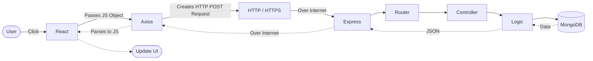
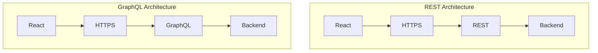

# 🌐 API & REST Fundamentals

## 📖 Table of Contents
- [1. HTTP (HyperText Transfer Protocol)](#1-http-hypertext-transfer-protocol)
- [2. HTTPS & Security Basics](#2-https--security-basics)
- [3. API (Application Programming Interface)](#3-api-application-programming-interface)
- [4. REST (Representational State Transfer)](#4-rest-representational-state-transfer)
- [5. The Frontend-Backend Communication Flow (The Mental Model)](#5-the-frontend-backend-communication-flow-the-mental-model)
  - [5.1 Calling External APIs: The Proxy Pattern](#51-calling-external-apis-the-proxy-pattern)
- [6. The Golden Rule of REST: Statelessness](#6-the-golden-rule-of-rest-statelessness)
- [7. REST in Action: HTTP Methods](#7-rest-in-action-http-methods)
- [8. Understanding Responses: HTTP Status Codes](#8-understanding-responses-http-status-codes)
- [9. REST Best Practices (URI Structure)](#9-rest-best-practices-uri-structure)
- [10. Advanced: API Architectural Patterns](#10-advanced-api-architectural-patterns)
  - [10.1 REST (Representational State Transfer)](#101-rest-representational-state-transfer)
  - [10.2 GraphQL (vs. REST)](#102-graphql-vs-rest)
  - [10.3 WebSockets](#103-websockets)
  - [10.4 gRPC (gRPC Remote Procedure Calls)](#104-grpc-grpc-remote-procedure-calls)
  - [10.5 SOAP (Simple Object Access Protocol)](#105-soap-simple-object-access-protocol)

---

## 1. HTTP (HyperText Transfer Protocol)

HTTP is a communication protocol that defines how a client (like a web browser) and a server exchange requests and responses over the web.

**What question does it answer?** *How do two applications communicate?*
**Technical Reality:** HTTP is the strict communication protocol that React and Express use to format and understand the data traveling between them.

**Components of an HTTP Request:**
*   **URL / Endpoint:** Tells the API what resource or action is needed (e.g., `/api/auth/login`).
*   **Method:** The action to perform (GET, POST, PUT, DELETE).
*   **Headers:** Metadata for the request (like authentication tokens or Content-Type).
*   **Body:** The actual data payload being sent (like a JSON object).
*   **(Optional) Query Parameters:** Modifiers in the URL for filtering/sorting.

> **Remember:** HTTP tells **how** to communicate over the web.

**Example of an HTTP Request:**
```http
POST /api/auth/login HTTP/1.1
Host: agrisense.com
Content-Type: application/json

{
   "email": "abc@gmail.com",
   "password": "123456"
}
```

---

## 2. HTTPS & Security Basics

Before discussing APIs, an SDE must understand how data is protected in transit (as it travels) and at rest (in the database).

### HTTPS & Encryption (Protecting Data in Transit)
HTTPS is the encrypted version of HTTP. It ensures that when your frontend sends an API request to the backend, the data travels through a secure, unreadable tunnel over the internet.
*   **Encryption is a Two-Way Function:** Data is mathematically locked into gibberish using a key. It can be unlocked (decrypted) later by the recipient if they hold the correct key.
*   **Who can read it?** Only the exact Client (e.g., your browser) and the Server can read the data. Anyone sitting in the middle—like a hacker on a public Wi-Fi network, your Internet Service Provider (ISP), or internet routers—will only see meaningless encrypted text.

**The HTTPS Data Flow (SSL/TLS Handshake):**
1. **Hello:** The Client requests a secure connection to `https://api.example.com`.
2. **Identity Verification:** The Server replies with its public SSL Certificate. The Client verifies this certificate to ensure the server is authentic and not an imposter.
3. **Key Agreement:** The Client and Server use asymmetric cryptography to securely generate and agree upon a temporary, secret "Session Key".
4. **Secure Transit:** From this point forward, the Client encrypts the HTTP request using the Session Key. The Server receives the gibberish, uses the exact same key to decrypt it, and processes the request.

### Hashing (Protecting Data at Rest)
Unlike encryption, **Hashing is a One-Way Function.** It takes an input (like a password) and scrambles it into a fixed-length string of characters. It is mathematically designed so that it *cannot* be reversed, decrypted, or unscrambled back into the original text.

*   **Real-World Use Case:** We use hashing specifically for storing passwords in databases (like MongoDB or PostgreSQL).
*   **Why?** If we stored passwords as plain text or simply encrypted them, a hacker who breaches our MongoDB database would gain the keys to decrypt every user's password. But if we *hash* the passwords, the hacker only steals irreversible hashes. They cannot read the passwords or log into user accounts.
*   **How Login Works with Hashes:** When a user attempts to log in, the backend takes the password they typed, runs it through the exact same hashing algorithm, and simply compares the *new* hash against the *stored* hash in MongoDB. If the hashes match, the password is correct!

### API Security Mechanisms
If APIs were unprotected, anyone could simply send a `DELETE /users` request and wipe your database. Therefore, APIs require robust protection. Common security boundaries include:
*   **Authentication (Who are you?):** Verifying identity (e.g., JWT).
*   **Authorization (What are you allowed to do?):** Enforcing permissions (e.g., Admin vs User).
*   **Input Validation (Is the request safe?):** Preventing malicious data entry.
*   **HTTPS Encryption:** Protecting data while it is in transit.
*   **Rate Limiting:** Preventing abuse (like DDoS or brute force) by limiting requests per minute.

> **Note:** In the AgriSense project, **JWT authentication** and **Rate Limiting** are implemented to provide robust API security.

---

## 3. API (Application Programming Interface)

An API is an interface that allows two different software applications to communicate and share data with each other.

> **Definition:** An API is a contract between two software systems that defines how they exchange requests and responses while hiding implementation details.

### Why do APIs exist? (Creating Boundaries)
If APIs didn't exist, every system would need to know every other system's internal workings. The frontend would have to write SQL queries and handle business rules. Everything would become tightly coupled, which is a disaster for scaling.

Instead, APIs create strict boundaries:

```text
       Frontend (React)
              |
         Backend API
              |
-----------------------------------
|         |           |           |
DB      Redis      Stripe    ML Service
```

The frontend **never** directly talks to MongoDB, Redis, or the ML Service. Everything goes through the Backend API. 

* **Clear Responsibility:** Each service has a specific job and communicates exclusively through well-defined contracts.
* **Loose Coupling:** If the backend switches from MongoDB to PostgreSQL, the frontend doesn't change because the API contract remains the same.
* **Independent Teams & Modularity:** Components can evolve independently. A React web app and an iOS app can use the exact same API.

> **Summary:** APIs enable independent systems to communicate through well-defined contracts. They reduce coupling, improve modularity, simplify integrations, and are the foundation of modern architectures like microservices.


**What question does it answer?** *What functionality does one application expose to another?* (e.g., Login API, Expense API).
**Technical Reality:** The frontend cannot execute backend code directly (e.g., `loginUser()`). Instead, it must call the specific endpoints (the API) exposed by the backend to request that functionality.

It provides:
*   Endpoints (URLs like `/users` or `/login`)
*   Functionality exposed by a server for clients to use
*   A way to automate workflows and integrate systems without knowing their internal code

> **Remember:** API tells **what** services are available.

### Terminology: API vs Endpoint
*   **API:** A set of related operations exposing a specific feature (e.g., the *Expense API*).
*   **Endpoint:** A unique combination of an HTTP method and a URL path that maps to a specific backend handler or resource.

> **What is an endpoint?**
> An endpoint is a unique combination of an HTTP method and a URL path that maps to a specific backend handler or resource.
> 
> **Examples:**
> *   `GET /users`
> *   `POST /users`
> *   `DELETE /users/123`

**Example (The Expense API):**
This single API contains multiple endpoints:
*   `GET    /api/expenses` (Endpoint to read)
*   `POST   /api/expenses` (Endpoint to create)
*   `PUT    /api/expenses/:id` (Endpoint to update)
*   `DELETE /api/expenses/:id` (Endpoint to delete)
### Implementation Example
An API endpoint is typically mapped to a specific controller function on the server.

**Example: Server Definition (Node.js/Express)**
```javascript
app.get('/users/1', (request, response) => {
    // 1. Authenticate Request
    // 2. Query Database for User 1
    const user = { id: 1, name: "John Doe" };
    
    // 3. Return JSON serialization
    response.json(user);
});
```

**Example: Client Invocation (React/Browser)**
```javascript
const fetchUser = async () => {
    const response = await fetch('https://api.example.com/users/1');
    const data = await response.json();
    console.log(data.name); 
}
```

### Types of APIs (By Release Policy)
"Release Policy" describes the access authorization level of the API.
*   **Open / Public APIs:** Externally accessible APIs available to developers and other users with minimal restrictions (e.g., Google Maps API).
*   **Internal / Private APIs:** Hidden from external users and only exposed within an organization to improve internal systems integration.
*   **Partner APIs:** Shared externally, but strictly authenticated and authorized for specific business partners.

*(Note: For a detailed technical breakdown of API Architectures like GraphQL, gRPC, and SOAP, see Section 10).*

---

## 4. REST (Representational State Transfer)

REST is an architectural style that defines a standard, predictable way to design APIs using HTTP.

**What question does it answer?** *How is the API designed?* (e.g., Resource-based endpoints like `/api/expenses`).
**Technical Reality:** Instead of randomly naming endpoints like `/createExpense` or `/getExpenses`, REST enforces a consistent, predictable organization utilizing HTTP methods and resource Nouns.

It provides:
*   Standard URL design using nouns, not verbs (e.g., `/users/5`)
*   Proper use of HTTP methods to perform actions
*   Stateless communication
*   Resource-based design
*   Consistent, fast, and scalable APIs

> **Remember:** REST tells **how to design** an API.

**Design Comparison:**
*   **RPC-style (Action-based):** `POST /getUsers` 
*   **RESTful (Resource-based):** `GET /users` 

**Identifying RESTful APIs**
> In AgriSense, we use endpoints like:
> *   `GET /api/weather`
> *   `POST /api/auth/login`
> *   `POST /api/expenses`
> *   `GET /api/expenses`
> *   `PUT /api/expenses/:id`
> *   `DELETE /api/expenses/:id`
> 
> They are RESTful because they strictly follow REST principles:
> 1. **Resource-based:** Resources are represented by nouns (expenses, weather, users).
> 2. **Standard Methods:** The HTTP methods (GET, POST, PUT, DELETE) define the action, not the URL.
> 3. **Representations:** Data is consistently exchanged as JSON.
> 4. **Stateless:** Each request contains everything needed to process it.

---

## 5. The Frontend-Backend Communication Flow (The Mental Model)

To truly understand web communication, you must separate the process into three distinct layers.

### The 3 Layers of Communication
1. **The Client Library (e.g., Axios, Fetch):** The tool used in the frontend code (like React) to trigger the request, attach headers/tokens, parse JSON, and handle errors.
2. **The Protocol (HTTP/HTTPS):** The actual vehicle (transport layer) that carries the request over the internet.
3. **The API Style (REST):** The architectural rules defining how the backend endpoints are designed.

**The Complete Request Lifecycle (React to Node.js):**

Let's trace exactly what happens when a user clicks a button:

1. **Step 1: The Request (Frontend)**
   * User clicks "Save Profile". React uses `axios` or `fetch` to create an HTTP Request.
   * It needs an **Endpoint** (`PUT /api/profile`), **Headers** (`Authorization: Bearer <token>`), and a **Body** (`{"name": "Ammu"}`).
2. **Step 2: The Endpoint & Router (Backend)**
   * The request hits your Node.js server. Express looks at the Method and Endpoint (`app.put('/api/profile')`) and routes it to the correct controller.
3. **Step 3: The Method & Controller Logic (Backend)**
   * The controller executes the business logic: validates the JWT token, checks the data, and executes the MongoDB update.
4. **Step 4: The Response (Backend -> Frontend)**
   * The backend finishes and sends an HTTP Response back, including a **Status Code** (`200 OK`) and a **Body** (`{"message": "Profile updated"}`).
5. **Step 5: The UI Update (Frontend)**
   * React receives the `200 OK` status and the JSON response, then updates the screen to show "Profile Saved!".



> **Summary: What happens when a frontend calls an API?**
> The frontend sends an HTTP request containing a method, URL, headers, and optionally a body. The backend router matches the endpoint, invokes the appropriate controller, executes business logic, interacts with databases or external services if required, constructs an HTTP response with a status code and data, and sends it back. The frontend processes the response and updates the UI.

### 5.1 Calling External APIs: The Proxy Pattern

A common architectural question is whether the frontend should call 3rd-party APIs directly, or if requests should be routed through your backend.

**Case 1: Direct Frontend Calls (e.g., Open-Meteo in AgriSense)**
You can call an external API directly from React (`React ➔ HTTPS ➔ External API`) if:
* It is a public API.
* It does not require a secret API key.
* It has CORS enabled for browsers.
* *Example:* The AgriSense weather widget fetches Open-Meteo directly to simplify the architecture.

**Case 2: Backend Proxy Calls (The Standard)**
Most APIs require secret keys (e.g., Google Maps). If React calls them directly, the API key is exposed in the browser's Network tab. Instead, the secure flow is:
`React ➔ Express Backend (reads key from .env) ➔ External API`

**Advantages of using the Backend as a Proxy:**
1. **Security:** API keys stay safely hidden on the server.
2. **Implementation Hiding:** You can swap out the external provider (e.g., moving from Open-Meteo to AccuWeather) purely in Express, without modifying React code.
3. **Data Aggregation:** The backend can fetch Weather, Soil data, and Crop recommendations from three different services, combine them, and send a single JSON response to React.
4. **Caching & Performance:** The backend can use Redis to cache external responses. If 500 users ask for local weather, the backend hits the external API once and serves the rest from cache, reducing latency.
5. **Validation & Rate Limiting:** The backend can validate inputs before making an external API call, and limit how many times a user can make requests to prevent abuse.

**Summary:** 
> "In AgriSense, we call Open-Meteo directly from the React frontend because it's a public API that requires no secrets. However, for APIs requiring credentials, or when we need caching, input validation, and data aggregation, we route requests through our Express backend to keep secrets secure and centralize business logic."

---

## 6. The Golden Rule of REST: Statelessness

To be a true REST API, it must follow certain constraints. The most critical is Statelessness.

**Statelessness** means every request from the client must contain all the information the server needs to fulfill it. The server does not store any "session" or history about the client between requests.

It provides:
*   **Independence:** Each request stands completely on its own as a discrete transaction.
*   **Security:** Authentication context (like a JWT token) must be explicitly passed with every request.
*   **Scalability:** The server avoids memory overhead from managing client sessions, enabling horizontal scaling across distributed instances.

> **Remember:** Statelessness means the server treats every request like a brand new interaction.

### Stateful vs Stateless Comparison
```mermaid
graph TD
    subgraph Stateful (NOT REST)
        C1[Client: "Log me in!"] --> S1((Server: "Okay, you are User 5. I will store this session."))
        C2[Client: "Get my data!"] --> S2((Server: "I verified my session store, you are User 5. Here is your data."))
    end

    subgraph Stateless (REST API)
        C3[Client: "Get data. I am User 5, here is my JWT!"] --> S3((Server: "I validated the JWT cryptographically. Here is your data."))
        C4[Client: "Get more data. I am User 5, here is my JWT again!"] --> S4((Server: "I validated the JWT cryptographically. Here is your data."))
    end
```

---

## 7. REST in Action: HTTP Methods

REST maps standard operations (CRUD: Create, Read, Update, Delete) directly to HTTP Methods.

It provides:
*   **GET (Read):** Retrieves a representation of a resource. 
    *   *Endpoint:* `GET /users`
*   **POST (Create):** Submits new data to create a resource. 
    *   *Payload:* `{"name": "John"}` -> `POST /users`
*   **PUT (Update):** Replaces an entire resource representation. 
    *   *Endpoint:* `PUT /users/123`
*   **PATCH (Modify):** Applies partial modifications to a resource. 
    *   *Payload:* `{"email": "new@email.com"}` -> `PATCH /users/123`
*   **DELETE (Remove):** Deletes a resource. 
    *   *Endpoint:* `DELETE /users/123`

> **Remember:** Enforce idempotency. `GET`, `PUT`, and `DELETE` should yield the same state regardless of how many times they are called.

---

## 8. Understanding Responses: HTTP Status Codes

When a REST API resolves a request, it returns a standardized 3-digit HTTP Status Code.

It provides:
*   **2xx (Success):** 
    *   `200 OK`: Standard success (e.g., Data retrieved successfully).
    *   `201 Created`: Success, resource created (e.g., Database insert successful).
*   **4xx (Client Error):** 
    *   `400 Bad Request`: Invalid parameters or malformed syntax.
    *   `401 Unauthorized`: Missing or invalid authentication token.
    *   `403 Forbidden`: Authenticated, but lacking specific authorization/permissions.
    *   `404 Not Found`: The requested URI does not exist.
*   **5xx (Server Error):** 
    *   `500 Internal Server Error`: Unhandled exception within the application logic.

> **Remember:** Status codes allow the client to handle control flow without parsing the response body.

---

## 9. REST Best Practices (URI Structure)

A robust REST API follows strict naming conventions and hierarchical logic.

It provides:
*   **Nouns Over Verbs:** Target entities, not operations. (`/users` instead of `/getUsers`).
*   **Pluralization:** Standardize on plural collections (`/products`, `/orders`).
*   **Logical Nesting:** Represent relational hierarchies clearly. 
    *   *Pattern:* `/users/123/orders` (Orders belonging to User ID 123).
*   **Query Parameters for Modifiers:** Use the query string for filtering, sorting, and pagination rather than modifying the base URI.
    *   *Pattern:* `/users?role=admin&sort=desc&limit=10`

> **Remember:** A well-designed REST URI is self-documenting and predictable.

---

## 10. Advanced: API Architectural Patterns

For a Software Engineer, understanding the trade-offs between different API architectural patterns is critical. "Architecture" defines the underlying data exchange protocol and structural constraints.

### The Communication Paradigm: Request-Response vs. Event-Driven
A common question explores communication models: *"Are APIs always synchronous?"*
*   **Request-Response (Synchronous):** The client sends a request and *waits* for a direct response (e.g., a typical Login API). There is direct communication.
*   **Event-Driven (Asynchronous):** The client fires a message (often through a message broker) and *doesn't wait*. Another service reacts to it later (e.g., an "Order Created" event).

> **Conclusion:** Standard web APIs (like REST and GraphQL over HTTP) are fundamentally **Synchronous (Request-Response)**. 

### 10.1 REST (Representational State Transfer)
An architectural style dependent on stateless, client-server communication, heavily utilizing standard HTTP constraints.
*   **Data Exchange Format:** Typically JSON or XML.
*   **Interaction Model:** Resource-centric. Clients interact with entities via uniform URIs.
*   **Primary Use Case:** Public-facing web services, standard CRUD operations, and systems requiring high cacheability and scalability.

### 10.2 GraphQL (vs. REST)
GraphQL is a query language and server-side runtime introduced to solve the core limitations of REST API design. While REST uses multiple endpoints (`/users`, `/expenses`), GraphQL typically uses a single endpoint (`POST /graphql`).

**The Problem with REST:**
1. **Over-fetching:** An endpoint returns a predefined structure. If React only needs a user's `name`, calling `GET /users/1` still downloads their email, address, phone number, and timestamps.
2. **Under-fetching (Multiple Requests):** If a dashboard needs User data, Expenses, and Weather, REST requires three separate HTTP requests, increasing latency:
   * `GET /api/users/me`
   * `GET /api/expenses`
   * `GET /api/weather`

**The GraphQL Solution:**
Instead of endpoints defining the response, the *client* dictates exactly what data it wants in a single request. 

*   **Example (AgriSense Dashboard):**
```graphql
query {
  user(id: 1) { name }
  expenses { total }
  weather { temperature }
}
```
The server resolves all three entities and returns exactly the requested fields:
```json
{
  "data": {
    "user": { "name": "Ammu" },
    "expenses": { "total": 5000 },
    "weather": { "temperature": 31 }
  }
}
``` 
*   **Mutations (Creating Data):** In REST we use `POST`/`PUT`. In GraphQL we use a `mutation`.
```graphql
mutation {
  createExpense(amount: 500, category: "Seeds") { id amount }
}
```
### How GraphQL Works Internally (The Single Endpoint)
A common question is: *"If every request goes to `/graphql`, how does the server know what to do?"*
The answer is: **The GraphQL server parses the query and routes it to resolver functions.**

**Step 1: The Request**
React sends a single HTTP POST request to `/graphql`. The body dictates exactly what it needs:
```graphql
query {
  user { name }
  expenses { amount }
}
```

**Step 2: Parsing & The Schema**
The GraphQL Server parses this. Instead of a URL router, it checks its **Schema** to ensure `user` and `expenses` exist.
```graphql
type Query {
  user: User
  expenses: [Expense]
}
```

**Step 3: Resolvers Execute**
Once validated, GraphQL asks: *"Who knows how to fetch user and expenses?"* It routes to **Resolvers** (functions identical to REST controllers).
```javascript
const resolvers = {
  Query: {
    user() { return User.findById(...); },
    expenses() { return Expense.find(...); }
  }
}
```

**Step 4: Merging the Result**
GraphQL waits for both resolvers, merges the data, and returns a single JSON response:
```json
{
  "data": {
    "user": { "name": "Ammu" },
    "expenses": [ { "amount": 500 } ]
  }
}
```

> **The Key Takeaway: REST vs GraphQL Routing**
> *   **REST:** The **URL** decides which controller runs (e.g., `GET /api/expenses` runs `expenseController`).
> *   **GraphQL:** The **Query Body** decides which resolver functions run (e.g., `expenses { ... }` runs `expenseResolver`). This is why a single `/graphql` endpoint can support many different operations!
*   **Protocol Note:** GraphQL does *not* replace HTTP. It is an architectural alternative to REST, not a transport protocol alternative. It still runs over HTTP:



**Summary:**
> "REST exposes multiple resource-based endpoints returning fixed data structures. GraphQL exposes a single endpoint where the client specifies exactly the data it needs. This eliminates over-fetching and reduces network round-trips for complex UI dashboards. However, for straightforward CRUD operations, REST remains simpler to implement and cache."

### 10.3 WebSockets
A communication protocol providing full-duplex, persistent channels over a single TCP connection. Once the connection is open, it stays open, bypassing the HTTP request-response overhead entirely.
*   **Data Exchange Format:** String (JSON) or Binary frames.
*   **Interaction Model:** Event-driven, bi-directional (server can push data to client without the client asking).
*   **Protocol Initiation:** Starts with an HTTP Upgrade handshake, transitioning to `ws://` or `wss://`.
*   **Primary Use Case:** Real-time applications requiring low latency (e.g., live chat, financial trading tickers, collaborative editing tools).

### 10.4 gRPC (gRPC Remote Procedure Calls)
A modern, open-source high-performance RPC framework developed by Google. It abstracts the network layer, allowing clients to directly invoke methods on a server application.
*   **Data Exchange Format:** Protocol Buffers (Protobuf). Instead of sending plain text like JSON, it sends strongly-typed, highly compressed binary data. Both sides use a `.proto` file to strictly define the data types.
*   **Network Protocol:** Uses HTTP/2, which allows "multiplexing" (sending multiple requests at the exact same time over a single connection), making it extremely fast.
*   **Interaction Model:** Action/Function-centric.
*   **Implementation Example:** `UserService.CreateUser({ name: "John" })` executes remotely.
*   **Primary Use Case:** Internal microservice-to-microservice communication, polyglot environments, and systems requiring maximum throughput, strict interface contracts, and low network footprint.

### 10.5 SOAP (Simple Object Access Protocol)
A highly structured, legacy messaging protocol defined by W3C standard specifications. It relies entirely on XML and enforces strict security and transaction compliance.
*   **The Contract (WSDL):** SOAP relies on a WSDL (Web Services Description Language) file. This is an XML document that acts as a strict, unbreakable contract. It explicitly lists every available function, the exact parameters they require, and the exact data types they return. If a client violates the WSDL, the request fails instantly.
*   **Data Exchange Format:** XML (wrapped in an Envelope structure).
*   **Interaction Model:** Action-centric, often utilizing WSDL for strict contract definition.
*   **Implementation Schema:**
```xml
<soap:Envelope xmlns:soap="http://www.w3.org/2003/05/soap-envelope">
  <soap:Body>
    <m:GetUser xmlns:m="http://api.example.org/">
      <m:Id>1</m:Id>
    </m:GetUser>
  </soap:Body>
</soap:Envelope>
```
*   **Primary Use Case:** Legacy enterprise integration, banking/financial services requiring ACID-compliant transactions, and environments demanding WS-Security built-in.
