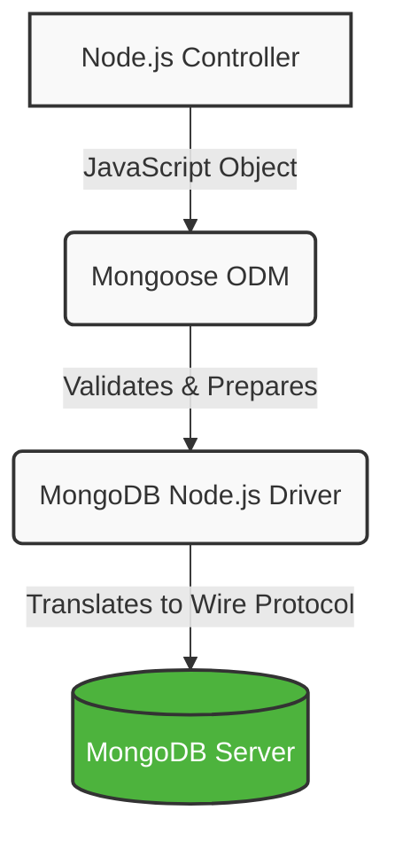

# Database Architecture: MongoDB & Mongoose

This document provides a highly structured architectural overview of the database layer in the AgriSense application, detailing the mechanics of MongoDB, the official Node.js Driver, and the Mongoose ODM.

## Quick Links
- [1. Core Definitions (MongoDB)](#1-core-definitions-mongodb)
- [2. What is Mongoose?](#2-what-is-mongoose)
- [3. Data Enforcement & Schemas](#3-data-enforcement--schemas)
- [4. What if Mongoose Was Removed?](#4-what-if-mongoose-was-removed)
- [5. Under the Hood: The 10-Step Write Flow](#5-under-the-hood-the-10-step-write-flow)
- [6. Advanced Interview Concepts](#6-advanced-interview-concepts)
- [7. Strategic Decision Matrix ("Why MongoDB?")](#7-strategic-decision-matrix-why-mongodb)
- [8. SQL vs. NoSQL: The Core Differences](#8-sql-vs-nosql-the-core-differences)

---

## 1. Core Definitions (MongoDB)

**MongoDB** is a NoSQL, document-oriented database. Unlike relational (SQL) databases that store data in rigid, normalized tables (Rows/Columns), MongoDB stores data as dynamically structured **BSON (Binary JSON)** documents. 

**The Power of Flexibility:**
MongoDB is inherently schema-flexible (often called schema-less). Documents in the same collection do not need to share the same structure. For example, all of these are valid in the same collection:
```json
{ "name": "Ammu" }
{ "name": "Ravi", "age": 21 }
{ "phone": "9876543210" }
```
This flexibility allows for rapid development, as evolving requirements do not require database schema migrations (`ALTER TABLE`).

## 2. What is Mongoose?

While MongoDB's flexibility is powerful, Node.js applications need a way to interface with it and enforce structure. 

A common misconception is that Node.js frameworks (like Express) communicate directly with MongoDB. This is false. Communication requires specific intermediary layers.

### The MongoDB Driver (The Protocol Translator)
Node.js processes JavaScript. The MongoDB server processes a proprietary binary wire protocol. The **official MongoDB Node.js Driver** acts as the necessary translation layer. It receives instructions from the backend application, converts them into MongoDB's wire protocol, and executes the network request.

### Mongoose (The Object Document Mapper)
While the Driver handles network communication, it does not enforce data integrity. If used directly, developers must manually validate data, apply defaults, and convert types before every database insertion.

**Mongoose** is an Object Document Mapper (ODM). It sits above the MongoDB Driver as an application-level enforcement layer. It maps raw JavaScript objects to structured MongoDB documents.



> **Interview Insight:** "Yes, Mongoose uses the official MongoDB Node.js driver internally. We don't interact with the driver directly because Mongoose provides a higher-level API with schemas, validation, models, and middleware. Under the hood, every Mongoose operation is eventually executed by the MongoDB driver."

## 3. Data Enforcement & Schemas

Mongoose enforces structure via **Schemas**. The schema serves as the definitive blueprint for collection documents.

```javascript
const userSchema = new mongoose.Schema({
  name: { type: String, required: true },
  age: Number
});
```

### Strict Mode Behavior
Mongoose controls how extra fields (not defined in the schema) are handled.

*   **`strict: true` (Default):** Extra fields are ignored. 
    *   *Insert:* `{ name: "Ammu", phone: "9876" }`
    *   *Saved as:* `{ name: "Ammu" }`
*   **`strict: false`:** Extra fields are allowed and saved to the database.
    *   *Insert:* `{ name: "Ammu", phone: "9876" }`
    *   *Saved as:* `{ name: "Ammu", phone: "9876" }`

### Mandatory Fields
Using `required: true` ensures the document cannot be saved without that specific field.

## 4. What if Mongoose Was Removed?

If AgriSense connected to MongoDB using only the native Node.js driver:
*   The entire `models/` folder would disappear.
*   Controllers would become bloated with manual checks for required fields, duplicate records, and data types.
*   Every insert would require manual timestamping (`createdAt`) and default value assignment.
*   The risk of data inconsistency and bugs would significantly increase.

## 5. Under the Hood: The Mongoose Write Flow

### Scenario: User Signup

Frontend sends:

```javascript
await axios.post("/api/auth/signup", {
    name: "Ammu",
    email: "ammu@gmail.com",
    age: "21"
});
```

---

### Step 1 — Controller receives request

```javascript
// authController.js

exports.signup = async (req, res) => {
    const { name, email, age } = req.body;

    const user = await User.create({
        name,
        email,
        age
    });

    res.json(user);
}
```

**Notice:** The controller simply calls `User.create(...)`. It doesn't know how MongoDB works.

---

### Step 2 — Mongoose receives it

```javascript
User.create({
    name,
    email,
    age
});
```

Now Mongoose starts working.

#### 2.1 Schema

```javascript
const userSchema = new mongoose.Schema({
    name: { type: String, required: true },
    email: { type: String, required: true },
    age: Number
},{
    timestamps: true
});
```

Mongoose first asks: `Does this object match my schema?`

#### 2.2 Validation

Incoming object:
```javascript
{
    name: "Ammu",
    email: "ammu@gmail.com",
    age: "21"
}
```

Checks:
```text
✔ name exists
✔ email exists
✔ age exists
```

If the payload was just `{ age: 21 }`, then:
```text
❌ name missing
↓
Validation Error
↓
STOP (Nothing goes to MongoDB)
```

#### 2.3 Type Casting

Incoming:
```javascript
age: "21"
```

Schema expects:
```javascript
age: Number
```

Mongoose automatically converts:
```text
"21" (String)  -->  21 (Number)
```

#### 2.4 Default Values

Suppose schema had:
```javascript
status: {
    type: String,
    default: "Active"
}
```

Since you didn't send `status`, Mongoose adds: `status: "Active"`

#### 2.5 Middleware

Suppose you had:
```javascript
userSchema.pre("save", async function() {
    this.password = await bcrypt.hash(this.password, 10);
});
```

Before saving:
```text
password  -->  bcrypt  -->  hashed password
```
The controller never hashes the password; Mongoose handles it centrally.

#### 2.6 Timestamps

Automatically adds `createdAt` and `updatedAt`.

Mongoose has now prepared the finalized payload:
```javascript
{
    name: "Ammu",
    email: "ammu@gmail.com",
    age: 21,
    status: "Active",
    createdAt: ...,
    updatedAt: ...
}
```
Now its job is over.

---

### Step 3 — MongoDB Driver (The Translator)

Mongoose internally calls the driver. You never see this directly. Internally, Mongoose triggers a driver function that looks like this:

```javascript
// Mongoose passing the clean JavaScript object to the MongoDB Driver
driver.collection('users').insertOne(document);
```

**What the Driver actually does (The Magic):**
The MongoDB Server (the actual database) **does not understand JavaScript**. It only understands a binary format called **BSON** (Binary JSON) over a network protocol. The Driver earns its paycheck here:

1. **BSON Translation:** The Driver takes the clean JavaScript object and converts it into raw binary data (BSON). For example, strings become UTF-8 byte arrays.
2. **Wire Protocol Packaging:** The Driver wraps that BSON data into a specific "MongoDB Wire Protocol" network packet.
3. **Transmission:** The Driver squirts that binary packet through the open TCP network connection directly to the MongoDB Server.

```text
JavaScript Object  -->  BSON Translation  -->  TCP Network  -->  MongoDB Server
```

Think of the driver as a **FedEx Delivery Service**: Mongoose packed the box and checked the labels, but the Driver is the truck that actually translates the request, drives over the internet, and delivers it to the warehouse. It does **NOT** validate, hash passwords, or check schemas.

---

### Step 4 — MongoDB Server

MongoDB receives:
```javascript
{
    name: "Ammu",
    email: "ammu@gmail.com",
    age: 21,
    status: "Active"
}
```

MongoDB execution:
```text
Store document  -->  Update indexes  -->  Write to disk  -->  Return Success
```

---

### Complete Visual Execution Flow

```text
               React
                 │
        axios.post(...)
                 │
────────────────────────────────────
          Express Controller
                 │
        User.create(...)
                 │
────────────────────────────────────
             Mongoose
     ✔ Schema Check
     ✔ Validation
     ✔ Type Casting
     ✔ Default Values
     ✔ Middleware
     ✔ Timestamps
                 │
────────────────────────────────────
        MongoDB Driver
     ✔ Connection
     ✔ Convert request
     ✔ Send request
                 │
────────────────────────────────────
         MongoDB Server
     ✔ Execute insert
     ✔ Update indexes
     ✔ Store BSON document
     ✔ Return response
                 │
────────────────────────────────────
         Express Controller
                 │
            res.json(...)
```

---

### Responsibilities Table

| Layer | Responsibility |
| :--- | :--- |
| **React** | Sends request |
| **Express Controller** | Calls `User.create()` |
| **Mongoose** | Schema, validation, type casting, defaults, middleware, timestamps, easy CRUD API |
| **MongoDB Driver** | Connects to MongoDB, sends commands, receives results, manages connections |
| **MongoDB Server** | Executes queries, stores BSON documents, manages indexes, replication, sharding, transactions |

---


## 6. Advanced Interview Concepts

While schemas and validation cover the basics, technical interviews frequently explore these advanced MongoDB and Mongoose capabilities:

### A. Indexing (Performance)
*   **Concept:** Indexes are data structures (B-Trees) that store a specific subset of data in an easy-to-traverse format.
*   **Why it matters:** Without an index, MongoDB performs a slow "Collection Scan" (checking every document). Indexes ensure lightning-fast query resolution.
*   **In Mongoose:** `userSchema.index({ email: 1 });`

### B. Mongoose Middleware (Hooks)
*   **Concept:** Functions that execute automatically before or after specific operations (e.g., `save`, `update`, `remove`).
*   **Why it matters:** Centralizes business logic. The classic use case is a `pre('save')` hook that automatically hashes a user's password using bcrypt before it is stored in the database.

### C. Handling Relationships (Population vs. Aggregation)
While MongoDB is non-relational, it has powerful mechanisms for joining data:
*   **Mongoose `.populate()`:** The ODM approach. You store an `ObjectId` referencing another document. When queried, Mongoose runs a secondary background query to fetch and attach the related data (e.g., `Post.find().populate('author')`).
*   **Aggregation Framework (`$lookup`):** The native MongoDB approach. The aggregation framework is a multi-stage data processing pipeline. Its `$lookup` stage acts exactly like a SQL Left Outer Join, merging data from two collections in a single database-level execution.

### D. ACID Transactions
*   **Concept:** Ensures a sequence of database operations either *all* succeed or *all* fail completely (vital for financial transfers).
*   **Why it matters:** A common interview trap is the myth that NoSQL databases cannot handle transactions. **MongoDB fully supports multi-document ACID transactions** (since v4.0).
*   **In Mongoose:** Implemented using connection sessions (`mongoose.startSession()` and `session.withTransaction()`).

## 7. Strategic Interview Questions: "Why MongoDB?"

Interviewers frequently ask you to justify your database choices. Be prepared to articulate the trade-offs between MongoDB (NoSQL) and traditional SQL databases.

### Q: Why did you choose MongoDB for this project?
> "I chose MongoDB because its document-oriented structure naturally maps to the JSON objects used in our Node.js backend, reducing impedance mismatch. The flexible schema allowed us to iterate quickly during development without managing continuous database migrations. Additionally, because our data often involves nested structures (like embedding a list of addresses inside a user profile), MongoDB can retrieve that entire entity in a single fast read operation, whereas SQL would require querying multiple tables with expensive JOINs."

### Q: When would you NOT use MongoDB? (Why SQL?)
> "I would avoid MongoDB for applications with highly interconnected, deeply relational data—such as a complex enterprise accounting system. If a system requires dozens of tightly coupled tables with heavy reliance on complex JOINs, a traditional SQL database like PostgreSQL is a better architectural fit. While MongoDB *does* support joins (`$lookup`) and ACID transactions, SQL databases were built specifically to optimize highly relational workloads."

## 8. SQL vs. NoSQL: The Core Differences

Understanding this comparison is essential for backend engineering interviews.

### A. Structure & Data Storage
*   **SQL (Relational):** Data is stored in strict **Tables** with Rows and Columns. Examples: PostgreSQL, MySQL, SQL Server.
*   **NoSQL (Non-Relational):** Data is stored in various formats, most commonly as **Documents** (JSON/BSON), but also as Key-Value pairs or Graphs. Examples: MongoDB, Redis, Neo4j.

### B. Schema (Rules)
*   **SQL:** Has a **Rigid Schema**. You must define your columns and data types before inserting anything. Adding a new field requires a database migration (`ALTER TABLE`).
*   **NoSQL:** Has a **Flexible/Dynamic Schema**. Documents in the same collection don't need to match. You can seamlessly insert a document with a new field without altering the database structure.

### C. Scaling (Handling Growth)
*   **SQL:** Scales **Vertically (Scale-up)**. To handle more traffic, you upgrade the existing server (more RAM, better CPU). Vertical scaling has physical and cost limits.
*   **NoSQL:** Scales **Horizontally (Scale-out)**. To handle more traffic, you add more cheap servers to the database cluster (Sharding). It can scale infinitely.

### D. Relationships (Joining Data)
*   **SQL:** Highly relational. Data is normalized (split into multiple tables to reduce duplication) and connected via **Foreign Keys**. Data is combined using powerful **JOIN** queries.
*   **NoSQL:** Less relational. Data is often denormalized. Instead of splitting data, related information is often **embedded** directly into a single document to make read operations extremely fast.

### E. When to use which?
*   **Choose SQL when:** Your data structure is highly predictable, you have complex relationships requiring heavy JOINs, or strict ACID compliance is the primary concern by default.
*   **Choose NoSQL when:** You need rapid development with an evolving data model, you are dealing with massive amounts of unstructured data, or you need extreme horizontal scalability.

> **Interview Pro-Tip:** Never say "NoSQL can't do relationships" or "SQL can't scale." Both *can* do what the other does (e.g., MongoDB has `$lookup` for joins, and Postgres has JSONB columns for flexible data), but they are **optimized** for different use cases.
