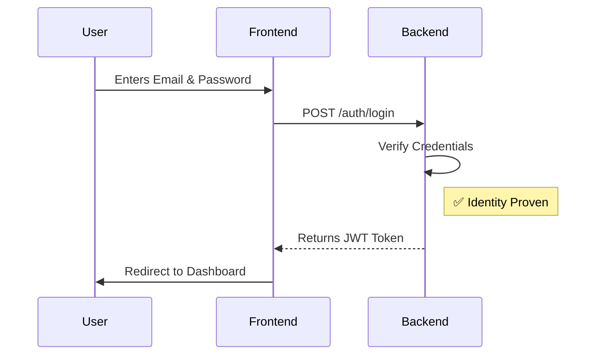
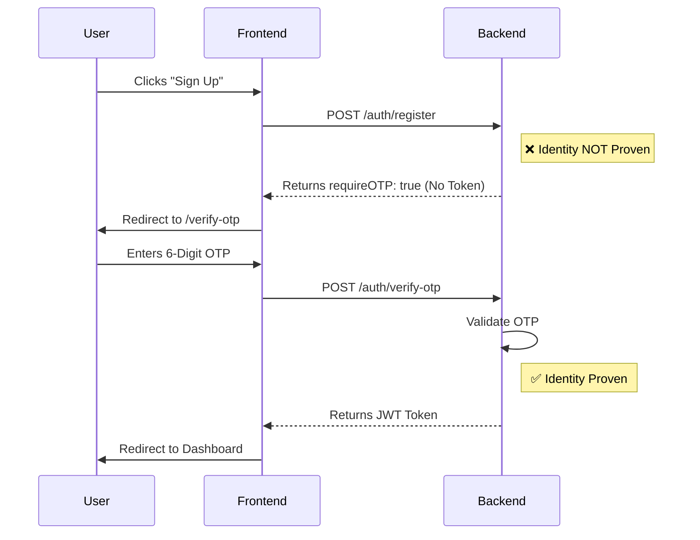

# AgriSense End-to-End Authentication Flows

This document details the exact step-by-step communication between the React Frontend and the Node.js Backend for every authentication process. It covers what the user does, the CRUD operations performed, the JSON responses, and how the frontend navigates as a result.

---
## 2. Core Layers: Controllers vs Services vs Utils

Once a request passes through the middleware and is routed correctly, it enters the **Layered Architecture**. The easiest way to understand this is the **Restaurant Analogy**.

### A. Controllers (The Waiter)
The Controller's *only* job is to talk to the client (the frontend). It has absolutely zero idea how the actual work is done.
- **What goes here:** Extracting data from the HTTP Request (`req.body`, `req.query`), calling a Service to do the heavy lifting, and returning an HTTP Response (`res.status(200).json()`).
- **What NEVER goes here:** Database queries (`User.findOne()`), complex math, formatting data, or talking to external APIs.
- **Analogy:** The Waiter takes your order (Request), hands the ticket to the kitchen, waits, and brings you your food (Response). The waiter doesn't cook.

### B. Services (The Chef)
The Service Layer is the heart of your application. This is where your "Business Logic" lives. 
- **What goes here:** Creating users in MongoDB, fetching data from Redis, calculating prices, scraping data, or calling a third-party weather API.
- **What NEVER goes here:** `req` or `res`. A service should never know that it is part of a web server. It should just take raw parameters and `return` data or `throw` an error.
- **Analogy:** The Chef receives the ticket, gathers ingredients (from the Database), cooks the meal (Business Logic), and puts it on the counter for the waiter to take.

### C. Utils (The Kitchen Tools)
Utils (Utilities) are small, purely functional "helpers" that can be used absolutely anywhere in your app. 
- **What goes here:** Formatting dates, calculating percentages, regex validators (checking if an email is valid), or converting units.
- **What NEVER goes here:** Database calls (`mongoose`), Redis calls, or specific business rules.
- **Analogy:** The knives, blenders, and measuring cups. They don't cook the meal themselves, but the Chef (Service) uses them constantly to get the job done faster.

### Architecture Code Example

**❌ Bad (Monolith Controller):**
```javascript
const login = async (req, res) => {
  // Controller doing Chef work:
  const user = await User.findOne({ email: req.body.email }); 
  const passwordMatches = bcrypt.compare(req.body.password, user.password);
  res.status(200).json(user);
};
```

**✅ Good (Separated Layers):**
```javascript
// --- util/formatters.js (The Tool) ---
const toLowercase = (email) => email.toLowerCase().trim();

// --- services/authService.js (The Chef) ---
const loginUser = async (rawEmail, password) => {
  const cleanEmail = toLowercase(rawEmail); // Uses a util
  const user = await User.findOne({ email: cleanEmail }); // Talks to DB
  return user; // Returns pure data
};

// --- controllers/authController.js (The Waiter) ---
const login = async (req, res) => {
  const { email, password } = req.body; // Takes the order
  const user = await loginUser(email, password); // Gives order to chef
  res.status(200).json(user); // Serves the food
};
```

---
## 1. Registration Flow

### A. Frontend Action (`Register.jsx`)
- **Trigger**: The user fills in Name, Email, and Password and clicks "Sign Up".
- **Communication**: The frontend uses Axios to send an HTTP POST request:
  ```javascript
  API.post("/auth/register", { name, email, password })
  ```

### B. Backend Matching (`routes/auth.js` -> `authController.js`)
- **Routing**: Express matches the `/auth/register` route and forwards the request to the `register` controller function.

### C. Backend Logic & CRUD Operations
1. **Read (MongoDB)**: The backend queries MongoDB (`User.findOne({ email })`) to check if a verified user with this email already exists.
2. **Hash**: The password is cryptographically hashed using `bcrypt`.
3. **Create (Redis Temp User)**: The backend saves the user details in a temporary Redis cache for 10 minutes (`redisClient.setTempUser`). *No data is written to MongoDB yet.*
4. **Create (Redis OTP)**: A 6-digit OTP is generated and stored in Redis with a 10-minute TTL.
5. **Action**: The backend calls your email provider (like Brevo/Nodemailer) to send the OTP email to the user.

### D. Response & Frontend Navigation
- **If Success**:
  - **Tokens Returned**: **NONE**.
  - **Data Returned**: `res.status(200).json({ message: "OTP sent to your email", requireOTP: true })`
  - **Frontend Handling**: React saves the user's email in `localStorage` (as `pending_email`) and navigates the user to the `/verify-otp` page using `navigate("/verify-otp")`.
- **If User Exists**:
  - **Returns**: `res.status(400).json({ message: "Email already registered" })`
  - **Frontend Handling**: React catches the error and displays the message in red on the UI.
- **If Email Fails**:
  - **Returns**: `res.status(500).json({ message: "Sorry, our email service is currently unavailable..." })`
  - **Frontend Handling**: React catches the error, displays it, and the user remains on the Registration page.

---

## 2. OTP Verification Flow

### A. Frontend Action (`VerifyOTP.jsx`)
- **Trigger**: The user types the 6-digit code from their email into the inputs.
- **Communication**: The frontend retrieves the `pending_email` from `localStorage`, combines it with the OTP, and sends a POST request:
  ```javascript
  API.post("/auth/verify-otp", { email: "user@agri.com", otp: "123456" })
  ```

### B. Backend Matching
- **Routing**: Express routes the request to the `verifyOTP` controller function.

### C. Backend Logic & CRUD Operations
1. **Read (Redis)**: The backend retrieves the saved OTP (`redisClient.get('otp:email')`) and compares it to the user's input.
2. **Read (Redis)**: If the OTP is correct, it fetches the temporary user data (`redisClient.getTempUser`).
3. **Create (MongoDB)**: The backend creates the actual permanent user record in MongoDB (`new User({...}).save()`) with `isVerified: true`.
4. **Delete (Redis)**: It deletes the OTP and the temporary user from Redis to clean up.
5. **Action**: The `generateTokens` helper is called to create the Access Token and Refresh Token. The Refresh Token is saved to Redis.

### D. Response & Frontend Navigation
- **If Success**:
  - **Tokens Returned**: 
    - **Access Token**: Returned in the JSON body.
    - **Refresh Token**: Returned hidden inside an secure `HTTP-Only Cookie` (NOT in the JSON).
  - **Data Returned**: 
    ```json
    {
      "token": "eyJhbGci...",
      "user": { "id": "64a7...", "name": "Yamini", "email": "user@agri.com" }
    }
    ```
  - **Frontend Handling**: React calls the Context API's `login(data)` function. This saves the **Access Token** in `localStorage`, saves the user details (`id`, `name`, `email`) in React state, and navigates the user straight to the dashboard (`navigate("/dashboard")`).
- **If OTP is Invalid/Expired**:
  - **Returns**: `res.status(400).json({ message: "Invalid OTP. Please try again." })`
  - **Frontend Handling**: React displays the error on the screen. The user stays on the OTP page.

---

## 3. Login Flow

### A. Frontend Action (`Login.jsx`)
- **Trigger**: The user enters their Email and Password and clicks "Login".
- **Communication**: The frontend sends a POST request:
  ```javascript
  API.post("/auth/login", { email, password })
  ```

### B. Backend Matching
- **Routing**: Express routes the request to the `login` controller function.

### C. Backend Logic & CRUD Operations
1. **Read (MongoDB)**: The backend queries MongoDB (`User.findOne({ email })`).
2. **Validation**: Checks if the user exists and if `isVerified` is true.
3. **Compare**: Uses `bcrypt.compare()` to check if the provided password matches the hashed password in the database.
4. **Action**: If passwords match, `generateTokens` is called. The Refresh Token is saved to Redis and set as a cookie.

### D. Response & Frontend Navigation
- **If Success**:
  - **Tokens Returned**: Same as Verify OTP (**Access Token** in JSON body + **Refresh Token** in HTTP-Only Cookie).
  - **Data Returned**: Same as Verify OTP (Access Token string + `{ id, name, email }` object).
  - **Frontend Handling**: `login(data)` is executed, storing the **Access Token** in `localStorage` and user details in state, and the user is redirected to the dashboard (`navigate("/dashboard")`).
- **If Invalid Password/Email**:
  - **Returns**: `res.status(400).json({ message: "Incorrect password" })`
  - **Frontend Handling**: React catches the error and displays it on the login screen.

---

## 4. Resend OTP Flow

### A. Frontend Action (`VerifyOTP.jsx`)
- **Trigger**: The user clicks the "Resend OTP" button.
- **Communication**: 
  ```javascript
  API.post("/auth/resend-otp", { email })
  ```

### B. Backend Logic & CRUD Operations
1. **Read (Redis & MongoDB)**: The backend checks if the user is in the Temp User Redis cache or permanently in MongoDB.
2. **Update/Create (Redis)**: A new 6-digit OTP is generated and the old key in Redis is overwritten with a new 10-minute TTL (`redisClient.setEx`).
3. **Action**: The backend emails the new code.

### C. Response & Frontend Navigation
- **If Success**:
  - **Tokens Returned**: **NONE**.
  - **Data Returned**: `res.status(200).json({ message: "OTP resent to your email" })`
  - **Frontend Handling**: React shows a success toast/notification. The user remains on the `/verify-otp` page to enter the new code.

---

## 5. Frequently Asked Questions (FAQ)

### Q: Is the JWT Token generated when the user clicks "Sign Up" on the registration page?
**No.** When a user registers, the backend only saves their data to a temporary cache (Redis) and sends them an email. We do not generate or hand out a token because we cannot verify they own that email address yet. 

Tokens are ONLY generated when the backend can **100% prove** the user's identity. This happens in two scenarios:
1. When they successfully **Login** (by proving they know the password).
2. When they successfully **Verify OTP** (by proving they received the email code—which is the final step of registration).

### Authentication Flow Diagrams

#### The Login Flow (Token Generated Immediately)


#### The Registration Flow (Token Generated ONLY after OTP)

