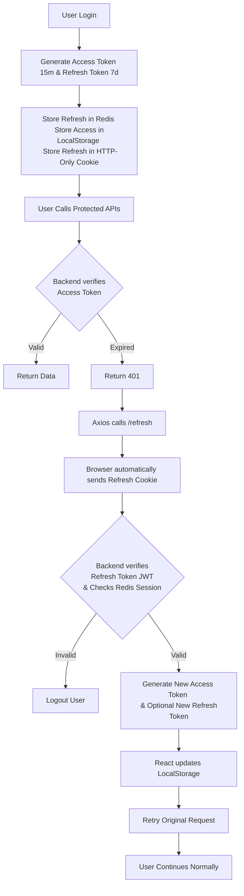
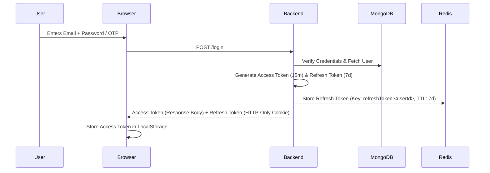
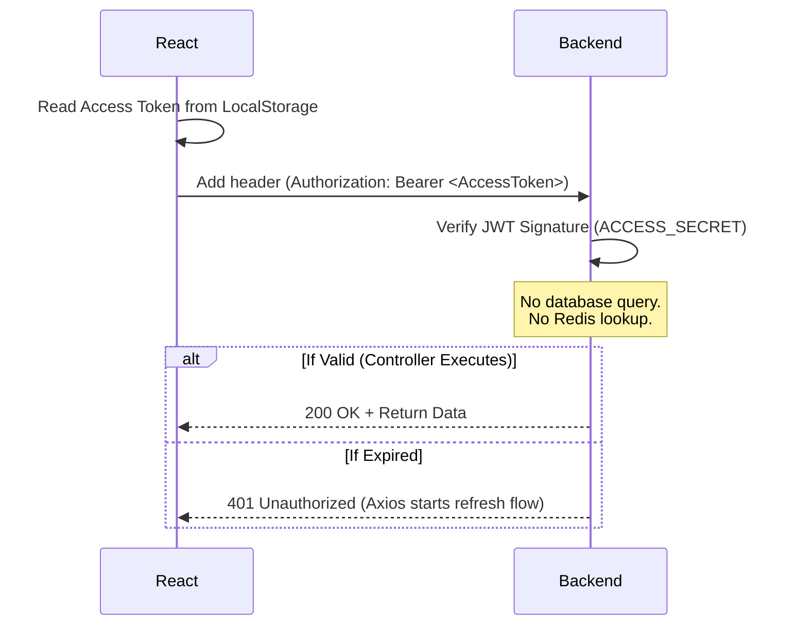
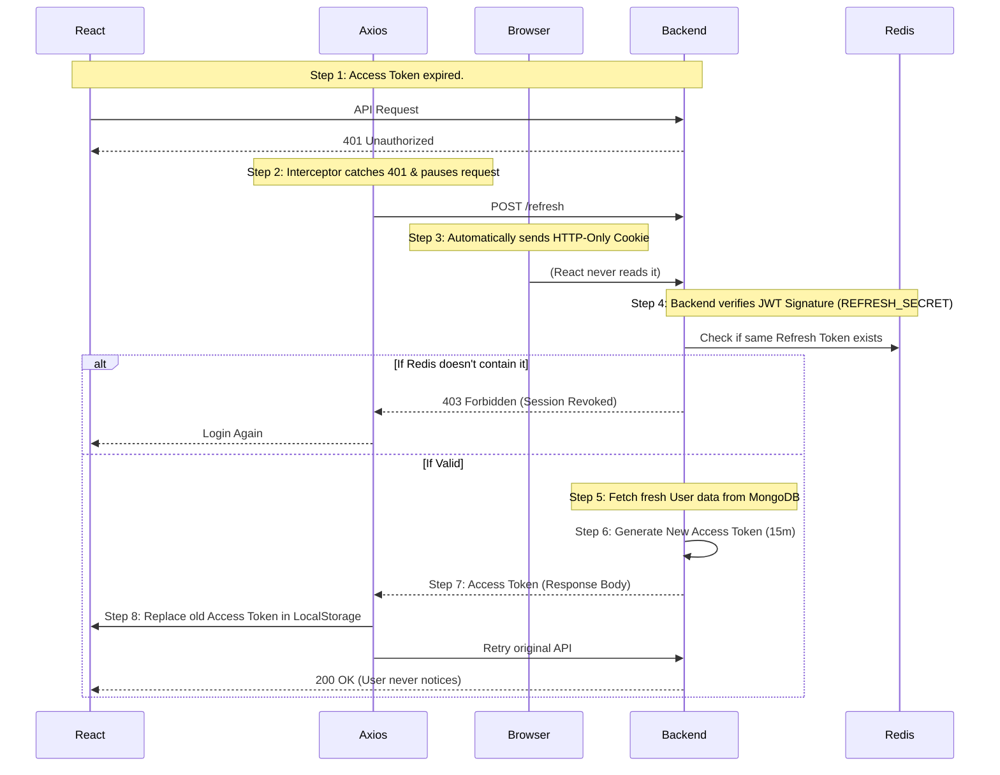
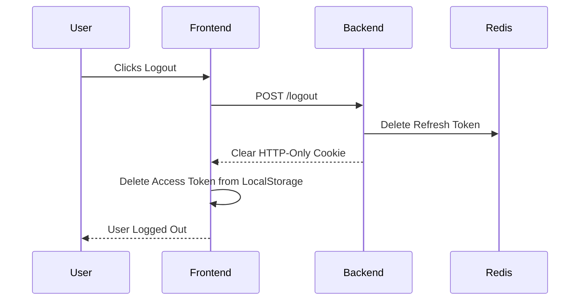

# AgriSense Authentication Architecture

This document details the end-to-end, highly optimized dual-token authentication system implemented in AgriSense.

## 1. High-Level Architecture Lifecycle



---

## 2. Tech Stack & Core Decisions

| Component | Purpose |
| :--- | :--- |
| **MongoDB** | Stores permanent user data (users, profile, etc.) |
| **Redis (Upstash)** | Stores active Refresh Token sessions (expires automatically after 7 days) |
| **JWT** | Creates cryptographically signed Access & Refresh Tokens |
| **Axios Interceptor** | Automatically pauses and refreshes expired Access Tokens on the frontend |

### Why Redis over MongoDB for Sessions?
- **Extreme Speed**: As an In-Memory Database, Redis provides O(1) lookups for session validation.
- **Automated Memory Management**: Redis supports TTL (Time-To-Live). It automatically removes expired sessions, meaning absolutely no Cron Jobs or background cleanup scripts are required. *(MongoDB would require complex TTL indexes and background sweeps).*

### Why Two Tokens?
If only **one** token existed (e.g., a 7-day JWT stored in LocalStorage), a successful XSS Attack would allow a hacker to steal the token and compromise the account for an entire week.

By using **two** tokens:
> - **Access Token (15 Minutes)**: Fast and stateless. Even if stolen, the attack window is extremely small.
> - **Refresh Token (7 Days)**: Provides the long-term session, but is protected inside an HTTP-Only Cookie where JavaScript cannot read it.

### JWT Secrets Architecture (Split Secrets)

AgriSense uses separate secrets for Access and Refresh tokens to enforce **separation of responsibilities**. This strictly limits the blast radius if a secret is ever compromised.

#### 1. If `ACCESS_SECRET` is Leaked
- **The Threat**: An attacker can forge Access Tokens with any payload (e.g., impersonating an admin). The server will accept them because the signature is mathematically valid.
- **The Containment**: The attacker **cannot** forge Refresh Tokens or use the `/refresh` endpoint, because doing so requires the separate `REFRESH_SECRET`. Rolling (changing) the `ACCESS_SECRET` instantly invalidates all forged tokens.

#### 2. If `REFRESH_SECRET` is Leaked
- **The Threat**: An attacker can mathematically forge a Refresh Token.
- **The Containment (Defense-in-Depth)**: In AgriSense, a cryptographically valid Refresh Token is **not enough**. The backend mandates that the exact token must also exist in **Redis** as an active session. Because the attacker cannot arbitrarily inject data into your Redis database, their forged Refresh Token is instantly rejected.

#### 3. The Danger of a Single Secret
If the **same secret** were used for both tokens, a single leak would grant an attacker total system control. They could forge both token types, impersonate any user indefinitely, and continuously request new Access Tokens. Splitting the secrets—and strictly coupling the Refresh Token to Redis—provides an enterprise-grade security layer.

---

## 3. Token Anatomy & Payloads

A JWT is a Base64-encoded string divided into three parts: `Header.Payload.Signature`.
The **Signature** is the core security mechanism: the backend combines the Header, Payload, and a secret key, then hashes them to create an unforgeable signature.

### A. The Access Token (UI Optimized)
- **Payload**: `{ "id": 123, "email": "user@agri.com", "name": "Yamini" }` 
- **Expiry (`exp`)**: Set to **15 minutes** from now.
- **Secret Key Used**: `ACCESS_SECRET`
- **Storage**: Frontend → `LocalStorage` (or Memory). Accessible by React/JS.
- **Transmission**: `Authorization: Bearer <AccessToken>`

### B. The Refresh Token (Security Optimized)
- **Payload**: `{ "id": 123 }`
- **Expiry (`exp`)**: Set to **7 days** from now.
- **Secret Key Used**: `REFRESH_SECRET`
- **Storage**: Browser → **HTTP-Only Cookie**. Inaccessible to React/JS.
- **Server Storage**: Redis → Key: `refreshToken:<userId>` | Value: Refresh Token | TTL: 7 Days.
- **Transmission**: Browser automatically attaches the Cookie (`refreshToken=...`) on `/refresh`.

### Payload Architecture (What to Include and Why)
For a dashboard application like AgriSense, the payloads are explicitly designed to balance speed and security:
- **Access Token (`id`, `name`, `email`)**: The frontend needs to display the user's name and email in the navbar or profile widget. By including these in the Access Token, React can instantly decode the token and display the information with zero network requests or loading spinners.
- **Refresh Token (`id`)**: This token is locked in an HTTP-Only cookie, so the frontend cannot read it. It is only used by the backend once every 15 minutes to look up the Redis session. Therefore, to minimize the security footprint, it contains *only* the `id`. When a refresh occurs, the backend uses this `id` to query MongoDB and inject the absolute freshest `name` and `email` into the brand new Access Token.

---

## 4. Threat Mitigation & Security Posture

- **Stateless Authorization**: Access Tokens rely purely on JWT Signature Verification using CPU math. No Redis or MongoDB lookups are required, resulting in lightning-fast authentication.
- **XSS (Cross-Site Scripting) Protection**: By storing the 7-day Refresh Token inside an **HTTP-Only Cookie**, we invoke a strict browser-level rule: *JavaScript is not allowed to touch this cookie*. Even a perfect XSS attack cannot steal the Refresh Token.
- **CSRF (Cross-Site Request Forgery) Protection**: We attach the `SameSite: Strict` and `Secure` flags to the HTTP-Only cookie. This tells the browser to *only* send the cookie if the user is actively sitting on the `agrisense.com` domain. If a request originates from an attacker's tab, the browser blocks the cookie entirely.
- **Instant Session Revocation**: If an admin blocks a user, the backend simply deletes the Refresh Token from Redis. While the current Access Token still works for a maximum of 15 minutes, the subsequent refresh attempt will fail, forcibly logging the user out.

---

## 5. Step-by-Step Lifecycle Flows

### Flow 1: Initial Login


### Flow 2: Protected API Request
*(Example: `GET /api/profile`)*


### Flow 3: Silent Token Refresh (The Axios Interceptor)


### Flow 4: Logout


---

## 6. Code Implementation Examples

### Creating a JWT: How It Works Under the Hood
When a user logs in or registers successfully, the backend creates signed JWTs. A JWT is constructed by combining three parts:
1. **Header**: Contains metadata like the signing algorithm (e.g., `HS256`).
2. **Payload (Data)**: The actual data we want to embed (e.g., `{ id, email, name }`).
3. **Signature**: Created by taking the Base64-encoded Header and Payload, combining them, and hashing them using our secret key (`ACCESS_SECRET` or `REFRESH_SECRET`).

We use the `jsonwebtoken` library's `sign` method, which automatically combines these parts, hashes them with the secret key, and outputs the final Base64 string (`Header.Payload.Signature`).

```javascript
// backend/controllers/authController.js
const jwt = require("jsonwebtoken");

const generateTokens = async (user, res) => {
  // 1. Create Access Token (short-lived, frontend accessible)
  const accessToken = jwt.sign(
    { id: user._id, email: user.email, name: user.name },
    process.env.ACCESS_SECRET,
    { expiresIn: "15m" }
  );

  // 2. Create Refresh Token (long-lived, HTTP-only cookie)
  const refreshToken = jwt.sign(
    { id: user._id },
    process.env.REFRESH_SECRET,
    { expiresIn: "7d" }
  );

  // Send refresh token as a secure cookie
  res.cookie("refreshToken", refreshToken, {
    httpOnly: true,
    secure: process.env.NODE_ENV === "production",
    sameSite: "strict",
    maxAge: 7 * 24 * 60 * 60 * 1000 // 7 days
  });

  return accessToken;
};
```

### Verifying a JWT: How Verification Works
When the user accesses a protected route, the backend receives the token but **does not trust it implicitly**. The `verify` method performs the following checks:
1. **Signature Validation**: It takes the Header and Payload from the incoming token, and hashes them again using our server's secret key (`ACCESS_SECRET`). If the resulting hash matches the Signature attached to the token, it proves the token was created by our server and hasn't been tampered with.
2. **Expiration Check**: It decodes the payload to check the `exp` (expiration) timestamp. If the current time is past the `exp` time, it rejects the token.

**What it returns:**
If both checks pass, `jwt.verify()` returns the **decoded payload object** (e.g., `{ id: '...', email: '...', name: '...', iat: ..., exp: ... }`). 

*Note on Encryption vs. Encoding*: The payload inside a JWT is **not encrypted**, it is only Base64-encoded. Anyone can read the contents by decoding it. However, because of the signature check, no one can *modify* the contents. If a hacker altered the payload (e.g., changed `id` to an admin's ID), the signature validation would fail because the hacker does not have the `ACCESS_SECRET` to re-hash and generate a valid signature for the altered payload.

```javascript
// backend/middleware/auth.js
const jwt = require("jsonwebtoken");

const auth = (req, res, next) => {
  // Extract token from "Bearer <token>"
  const token = req.headers.authorization?.split(" ")[1]; 
  if (!token) return res.status(401).json({ message: "No token, unauthorized" });

  try {
    // verify() throws an error if token is expired or signature is invalid
    const decoded = jwt.verify(token, process.env.ACCESS_SECRET);
    req.user = decoded; // Attach payload { id, email, name } to request
    next();             // Proceed to the protected controller
  } catch {
    res.status(401).json({ message: "Invalid token" });
  }
};
```
