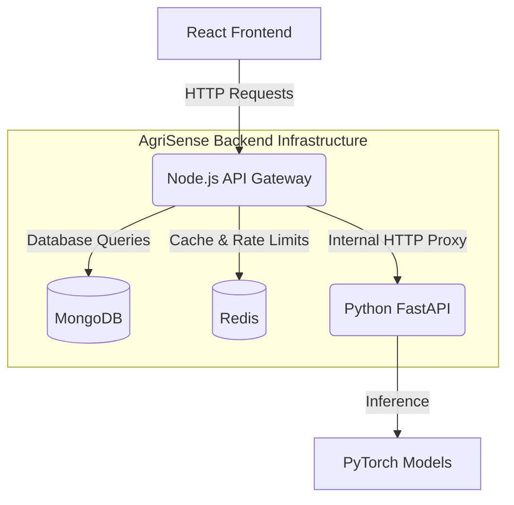
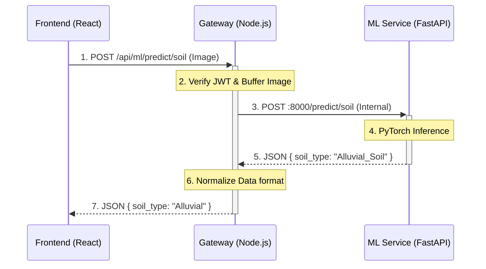
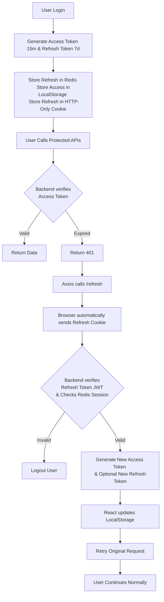
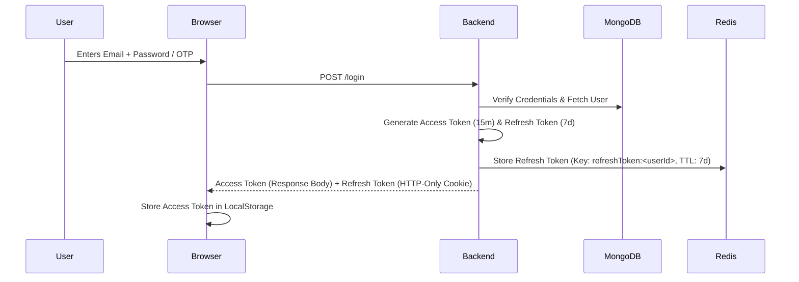
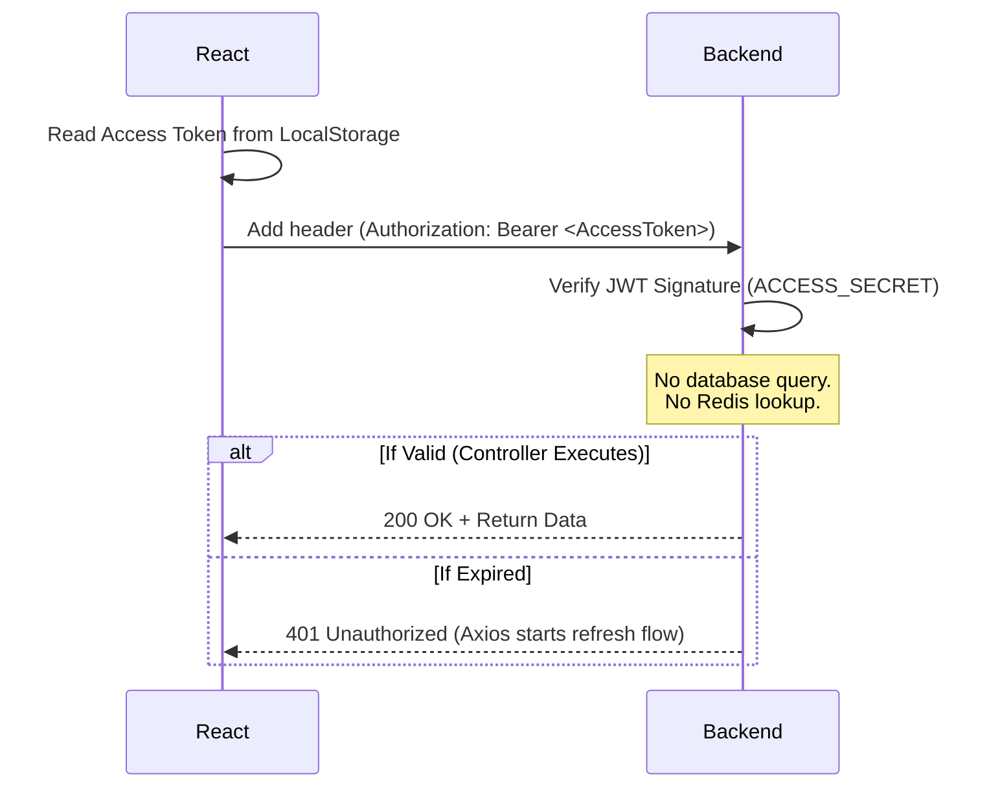
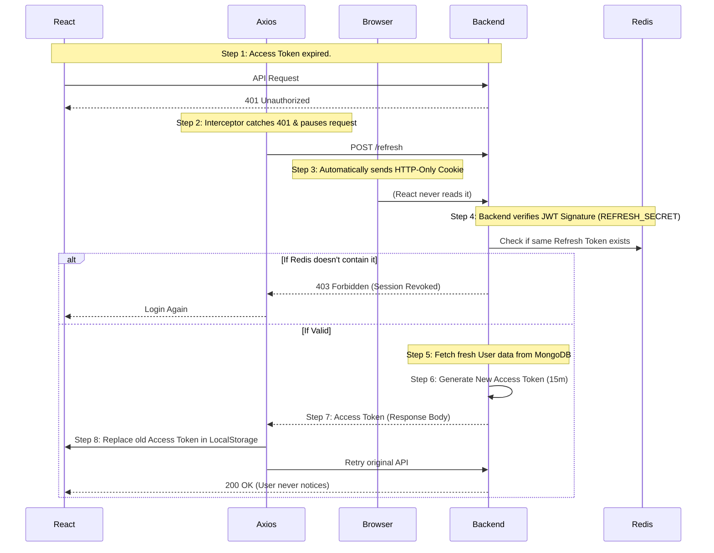
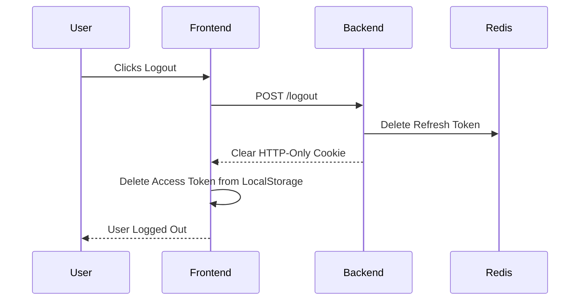
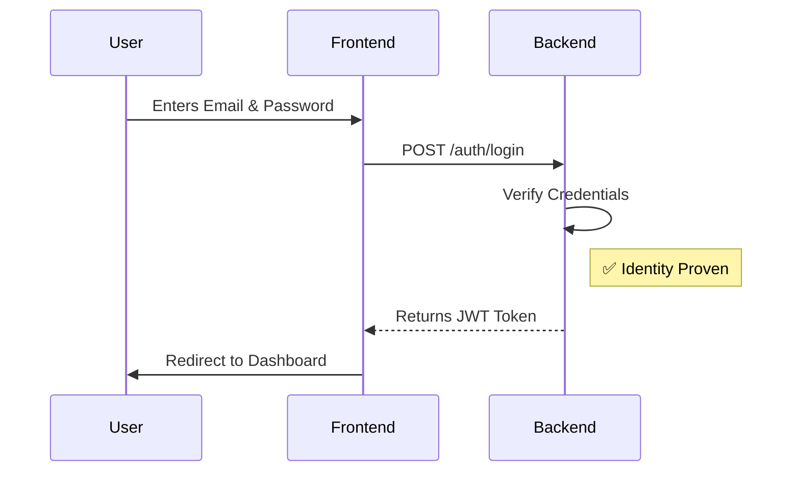
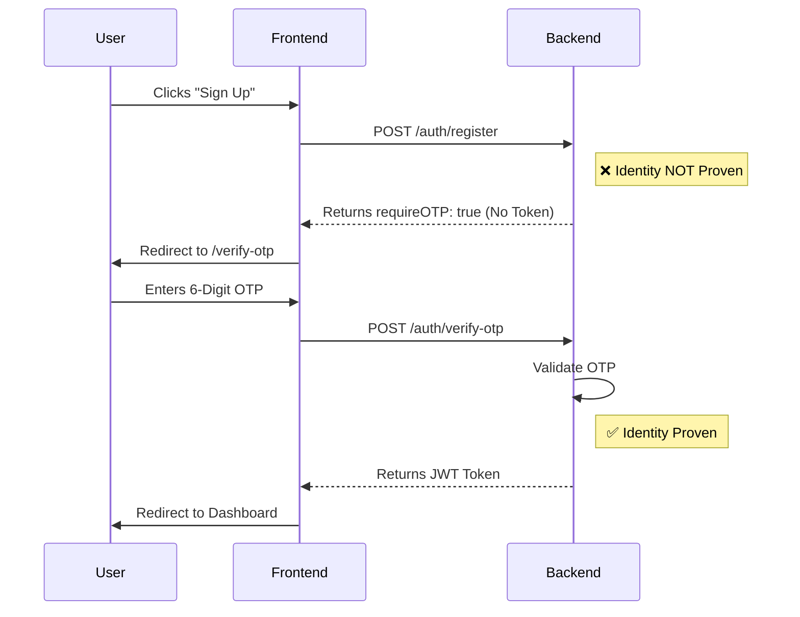
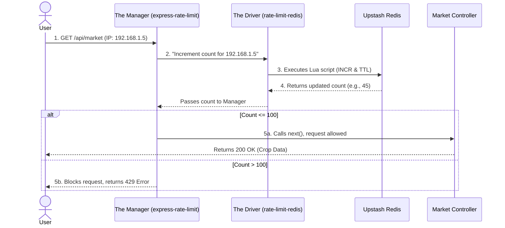

# AgriSense Complete Documentation

## Table of Contents

1. [🌐 API & REST Fundamentals](#api-rest-fundamentals)
2. [System Architecture & API Gateway Integration](#system-architecture-api-gateway-integration)
3. [2. Core Layers: Controllers vs Services vs Utils](#2-core-layers-controllers-vs-services-vs-utils)
4. [Proxy Architecture & Network Routing Guide](#proxy-architecture-network-routing-guide)
5. [AgriSense ML API Contract](#agrisense-ml-api-contract)
6. [🌐 Frontend Architecture: The API Abstraction Layer](#frontend-architecture-the-api-abstraction-layer)
7. [AgriSense Authentication Architecture](#agrisense-authentication-architecture)
8. [AgriSense End-to-End Authentication Flows](#agrisense-end-to-end-authentication-flows)
9. [Database Architectures: Redis vs. MongoDB](#database-architectures-redis-vs-mongodb)
10. [🚦 Rate Limiting: The Complete Engineering Guide (Interview Ready)](#rate-limiting-the-complete-engineering-guide-interview-ready)

---

<!-- SOURCE: webAPIs_REST.md -->

# 🌐 API & REST Fundamentals

## 1. HTTP (HyperText Transfer Protocol)

HTTP is a communication protocol that defines how a client (like a web browser) and a server exchange requests and responses over the web.

It provides:
*   Methods for action (GET, POST, PUT, DELETE, PATCH)
*   Headers for metadata (like authentication tokens)
*   A Body for sending data payloads (like a JSON object)
*   Status codes for results (200 OK, 404 Not Found, 500 Server Error)
*   Strict rules for web communication

> **Remember:** HTTP tells **how** to communicate over the web.

**Example of an HTTP Request:**
```http
GET /users/1 HTTP/1.1
Host: api.example.com
Authorization: Bearer my_secret_token
```

---

## 2. HTTPS & Security Basics

Before discussing APIs, an SDE must understand how data is protected in transit (as it travels) and at rest (in the database).

### HTTPS & Encryption (Protecting Data in Transit)
HTTPS is the encrypted version of HTTP. It ensures that when your frontend sends an API request to the backend, the data travels through a secure, unreadable tunnel over the internet.
*   **Encryption is a Two-Way Function:** Data is mathematically locked into gibberish using a key. It can be unlocked (decrypted) later by the recipient if they hold the correct key.
*   **Who can read it?** Only the exact Client (e.g., your browser) and the Server can read the data. Anyone sitting in the middle—like a hacker on a public Wi-Fi network, your Internet Service Provider (ISP), or internet routers—will only see meaningless encrypted text.

**The HTTPS Data Flow (SSL/TLS Handshake):**
1. **Hello:** The Client requests a secure connection to `https://api.example.com`.
2. **Identity Verification:** The Server replies with its public SSL Certificate. The Client verifies this certificate to ensure the server is authentic and not an imposter.
3. **Key Agreement:** The Client and Server use asymmetric cryptography to securely generate and agree upon a temporary, secret "Session Key".
4. **Secure Transit:** From this point forward, the Client encrypts the HTTP request using the Session Key. The Server receives the gibberish, uses the exact same key to decrypt it, and processes the request.

### Hashing (Protecting Data at Rest)
Unlike encryption, **Hashing is a One-Way Function.** It takes an input (like a password) and scrambles it into a fixed-length string of characters. It is mathematically designed so that it *cannot* be reversed, decrypted, or unscrambled back into the original text.

*   **Real-World Use Case:** We use hashing specifically for storing passwords in databases (like MongoDB or PostgreSQL).
*   **Why?** If we stored passwords as plain text or simply encrypted them, a hacker who breaches our MongoDB database would gain the keys to decrypt every user's password. But if we *hash* the passwords, the hacker only steals irreversible hashes. They cannot read the passwords or log into user accounts.
*   **How Login Works with Hashes:** When a user attempts to log in, the backend takes the password they typed, runs it through the exact same hashing algorithm, and simply compares the *new* hash against the *stored* hash in MongoDB. If the hashes match, the password is correct!

---

## 3. API (Application Programming Interface)

An API is an interface that allows two different software applications to communicate and share data with each other. Think of it as a restaurant waiter: you (the client) tell the waiter (the API) what you want, and the waiter gets it from the kitchen (the server/database) and brings it back to you.

It provides:
*   Endpoints (URLs like `/users` or `/login`)
*   Functionality exposed by a server for clients to use
*   A way to automate workflows and integrate systems without knowing their internal code

> **Remember:** API tells **what** services are available.


### Implementation Example
An API endpoint is typically mapped to a specific controller function on the server.

**Example: Server Definition (Node.js/Express)**
```javascript
app.get('/users/1', (request, response) => {
    // 1. Authenticate Request
    // 2. Query Database for User 1
    const user = { id: 1, name: "John Doe" };
    
    // 3. Return JSON serialization
    response.json(user);
});
```

**Example: Client Invocation (React/Browser)**
```javascript
const fetchUser = async () => {
    const response = await fetch('https://api.example.com/users/1');
    const data = await response.json();
    console.log(data.name); 
}
```

### Types of APIs (By Release Policy)
"Release Policy" describes the access authorization level of the API.
*   **Open / Public APIs:** Externally accessible APIs available to developers and other users with minimal restrictions (e.g., Google Maps API).
*   **Internal / Private APIs:** Hidden from external users and only exposed within an organization to improve internal systems integration.
*   **Partner APIs:** Shared externally, but strictly authenticated and authorized for specific business partners.

*(Note: For a detailed technical breakdown of API Architectures like GraphQL, gRPC, and SOAP, see Section 9).*

---

## 4. REST (Representational State Transfer)

REST is an architectural style that defines a standard, predictable way to design APIs using HTTP.

It provides:
*   Standard URL design using nouns, not verbs (e.g., `/users/5`)
*   Proper use of HTTP methods to perform actions
*   Stateless communication
*   Resource-based design
*   Consistent, fast, and scalable APIs

> **Remember:** REST tells **how to design** an API.

**Design Comparison:**
*   **RPC-style (Action-based):** `POST /getUsers` 
*   **RESTful (Resource-based):** `GET /users` 

---

## 5. The Golden Rule of REST: Statelessness

To be a true REST API, it must follow certain constraints. The most critical is Statelessness.

**Statelessness** means every request from the client must contain all the information the server needs to fulfill it. The server does not store any "session" or history about the client between requests.

It provides:
*   **Independence:** Each request stands completely on its own as a discrete transaction.
*   **Security:** Authentication context (like a JWT token) must be explicitly passed with every request.
*   **Scalability:** The server avoids memory overhead from managing client sessions, enabling horizontal scaling across distributed instances.

> **Remember:** Statelessness means the server treats every request like a brand new interaction.

### Stateful vs Stateless Comparison
```mermaid
graph TD
    subgraph Stateful (NOT REST)
        C1[Client: "Log me in!"] --> S1((Server: "Okay, you are User 5. I will store this session."))
        C2[Client: "Get my data!"] --> S2((Server: "I verified my session store, you are User 5. Here is your data."))
    end

    subgraph Stateless (REST API)
        C3[Client: "Get data. I am User 5, here is my JWT!"] --> S3((Server: "I validated the JWT cryptographically. Here is your data."))
        C4[Client: "Get more data. I am User 5, here is my JWT again!"] --> S4((Server: "I validated the JWT cryptographically. Here is your data."))
    end
```

---

## 6. REST in Action: HTTP Methods

REST maps standard operations (CRUD: Create, Read, Update, Delete) directly to HTTP Methods.

It provides:
*   **GET (Read):** Retrieves a representation of a resource. 
    *   *Endpoint:* `GET /users`
*   **POST (Create):** Submits new data to create a resource. 
    *   *Payload:* `{"name": "John"}` -> `POST /users`
*   **PUT (Update):** Replaces an entire resource representation. 
    *   *Endpoint:* `PUT /users/123`
*   **PATCH (Modify):** Applies partial modifications to a resource. 
    *   *Payload:* `{"email": "new@email.com"}` -> `PATCH /users/123`
*   **DELETE (Remove):** Deletes a resource. 
    *   *Endpoint:* `DELETE /users/123`

> **Remember:** Enforce idempotency. `GET`, `PUT`, and `DELETE` should yield the same state regardless of how many times they are called.

---

## 7. Understanding Responses: HTTP Status Codes

When a REST API resolves a request, it returns a standardized 3-digit HTTP Status Code.

It provides:
*   **2xx (Success):** 
    *   `200 OK`: Standard success (e.g., Data retrieved successfully).
    *   `201 Created`: Success, resource created (e.g., Database insert successful).
*   **4xx (Client Error):** 
    *   `400 Bad Request`: Invalid parameters or malformed syntax.
    *   `401 Unauthorized`: Missing or invalid authentication token.
    *   `403 Forbidden`: Authenticated, but lacking specific authorization/permissions.
    *   `404 Not Found`: The requested URI does not exist.
*   **5xx (Server Error):** 
    *   `500 Internal Server Error`: Unhandled exception within the application logic.

> **Remember:** Status codes allow the client to handle control flow without parsing the response body.

---

## 8. REST Best Practices (URI Structure)

A robust REST API follows strict naming conventions and hierarchical logic.

It provides:
*   **Nouns Over Verbs:** Target entities, not operations. (`/users` instead of `/getUsers`).
*   **Pluralization:** Standardize on plural collections (`/products`, `/orders`).
*   **Logical Nesting:** Represent relational hierarchies clearly. 
    *   *Pattern:* `/users/123/orders` (Orders belonging to User ID 123).
*   **Query Parameters for Modifiers:** Use the query string for filtering, sorting, and pagination rather than modifying the base URI.
    *   *Pattern:* `/users?role=admin&sort=desc&limit=10`

> **Remember:** A well-designed REST URI is self-documenting and predictable.

---

## 9. Advanced: API Architectural Patterns

For a Software Engineer, understanding the trade-offs between different API architectural patterns is critical. "Architecture" defines the underlying data exchange protocol and structural constraints.

### 9.1 REST (Representational State Transfer)
An architectural style dependent on stateless, client-server communication, heavily utilizing standard HTTP constraints.
*   **Data Exchange Format:** Typically JSON or XML.
*   **Interaction Model:** Resource-centric. Clients interact with entities via uniform URIs.
*   **Primary Use Case:** Public-facing web services, standard CRUD operations, and systems requiring high cacheability and scalability.

### 9.2 GraphQL
A query language and server-side runtime developed by Facebook to optimize data fetching over a single endpoint. It resolves the common REST issues of **over-fetching** (getting too much data) and **under-fetching** (not getting enough data and having to make more requests).
*   **Data Exchange Format:** JSON.
*   **Interaction Model:** Graph-centric. The client defines the exact data structure required.
*   **Client Query Schema:**
```graphql
query GetUserAndPosts {
  user(id: 1) {
    name
    email
    posts { title }
  }
}
```
*   **Server Response Schema:**
```json
{
  "data": {
    "user": {
      "name": "John Doe",
      "email": "john@example.com",
      "posts": [{ "title": "First Post" }]
    }
  }
}
```
*   **Primary Use Case:** Highly relational data models, mobile applications with bandwidth constraints, and complex frontends (e.g., React applications) requiring aggregated data from multiple microservices simultaneously.

### 9.3 WebSockets
A communication protocol providing full-duplex, persistent channels over a single TCP connection. Once the connection is open, it stays open, bypassing the HTTP request-response overhead entirely.
*   **Data Exchange Format:** String (JSON) or Binary frames.
*   **Interaction Model:** Event-driven, bi-directional (server can push data to client without the client asking).
*   **Protocol Initiation:** Starts with an HTTP Upgrade handshake, transitioning to `ws://` or `wss://`.
*   **Primary Use Case:** Real-time applications requiring low latency (e.g., live chat, financial trading tickers, collaborative editing tools).

### 9.4 gRPC (gRPC Remote Procedure Calls)
A modern, open-source high-performance RPC framework developed by Google. It abstracts the network layer, allowing clients to directly invoke methods on a server application.
*   **Data Exchange Format:** Protocol Buffers (Protobuf). Instead of sending plain text like JSON, it sends strongly-typed, highly compressed binary data. Both sides use a `.proto` file to strictly define the data types.
*   **Network Protocol:** Uses HTTP/2, which allows "multiplexing" (sending multiple requests at the exact same time over a single connection), making it extremely fast.
*   **Interaction Model:** Action/Function-centric.
*   **Implementation Example:** `UserService.CreateUser({ name: "John" })` executes remotely.
*   **Primary Use Case:** Internal microservice-to-microservice communication, polyglot environments, and systems requiring maximum throughput, strict interface contracts, and low network footprint.

### 9.5 SOAP (Simple Object Access Protocol)
A highly structured, legacy messaging protocol defined by W3C standard specifications. It relies entirely on XML and enforces strict security and transaction compliance.
*   **The Contract (WSDL):** SOAP relies on a WSDL (Web Services Description Language) file. This is an XML document that acts as a strict, unbreakable contract. It explicitly lists every available function, the exact parameters they require, and the exact data types they return. If a client violates the WSDL, the request fails instantly.
*   **Data Exchange Format:** XML (wrapped in an Envelope structure).
*   **Interaction Model:** Action-centric, often utilizing WSDL for strict contract definition.
*   **Implementation Schema:**
```xml
<soap:Envelope xmlns:soap="http://www.w3.org/2003/05/soap-envelope">
  <soap:Body>
    <m:GetUser xmlns:m="http://api.example.org/">
      <m:Id>1</m:Id>
    </m:GetUser>
  </soap:Body>
</soap:Envelope>
```
*   **Primary Use Case:** Legacy enterprise integration, banking/financial services requiring ACID-compliant transactions, and environments demanding WS-Security built-in.

---

<!-- SOURCE: system_architecture.md -->

# System Architecture & API Gateway Integration

This document outlines the high-level system design, service boundaries, and internal network proxying mechanisms utilized within the AgriSense platform. 

## 1. Microservice Ecosystem Overview

AgriSense is designed using a dual-backend microservice architecture to isolate computational boundaries and optimize resource allocation.

*   **Primary Gateway (Node.js / Express):** Operating on port `5000`, this service acts as the central ingress point for all client traffic. It handles I/O bound tasks, authentication, database operations (MongoDB), caching (Redis), and rate limiting.
*   **Machine Learning Engine (Python / FastAPI):** Operating on port `8000`, this isolated microservice is strictly responsible for CPU-bound tasks, specifically executing PyTorch and scikit-learn model inferences for soil classification, crop recommendation, and price forecasting.

Client applications (React Frontend) **never** interact directly with the Machine Learning Engine. The Node.js service abstracts this complexity.



> [!NOTE]
> **Friendly Note for Interviews:** If they ask *why* you separated Node and Python, tell them it's about playing to their strengths. Node.js is incredibly fast at handling thousands of small, simultaneous network requests (I/O bound). Python is the undisputed king of heavy, mathematical Machine Learning (CPU bound). If you put them both in one server, Python's heavy math would freeze the Node.js server!

---

## 2. The API Gateway Pattern

To enforce strict security and simplify client-side network management, the Node.js Express server implements the **API Gateway Pattern**. 

### Core Responsibilities of the Gateway:
1.  **Centralized Authentication:** Instead of requiring both Node.js and Python to validate JWT tokens, the Express Gateway intercepts all incoming traffic, validates the session, and rejects unauthorized requests before they ever reach internal services.
2.  **Request Sanitization & Validation:** The Gateway ensures that payloads conform to expected schemas and file size limits (via `multer`) before forwarding.
3.  **Reverse Proxying:** The Gateway acts as a transparent proxy. It takes validated requests, constructs internal network calls to the Python service, awaits the computation, and returns the serialized JSON to the client.

> [!TIP]
> **Analogy:** Imagine a massive corporate office building. An API Gateway is the **front desk receptionist**. The React frontend doesn't need to memorize where the ML department is. It just hands the request to the Node.js receptionist, and Node.js routes it to the correct hidden department.

---

## 3. Inter-Service Communication Trace: Soil Classification

To illustrate the data flow across service boundaries, consider the end-to-end execution of a Soil Classification request.



1.  **Client Ingress:** The React client dispatches a `multipart/form-data` payload containing an image to `POST https://api.agrisense.com/api/ml/predict/soil`.
2.  **Gateway Security & Parsing (Node.js):**
    *   The `protect` middleware verifies the HTTP-Only JWT.
    *   The `multer` middleware buffers the incoming image stream into RAM, enforcing a 10MB limit.
3.  **Proxy Invocation:** The Express controller repackages the image buffer into an internal `FormData` payload. Using Axios, it makes a synchronous HTTP POST request over the internal network to the FastAPI service (`http://localhost:8000/predict/soil`).
4.  **AI Inference (Python):**
    *   FastAPI routes the payload to the PyTorch inference engine.
    *   The model evaluates the image tensor and generates class probabilities.
    *   FastAPI responds to the Gateway with a JSON object containing the classification and confidence scores.
5.  **Data Normalization & Egress (Node.js):** 
    *   The Gateway receives the internal response.
    *   It normalizes the data structure (e.g., stripping internal suffix naming conventions).
    *   Finally, the Gateway serializes the payload and transmits the HTTP 200 OK response back to the original React client.

---

## 🎯 Interview Cheat Sheet: Architecture & Data Flow

If an interviewer asks you: **"How do the frontend and backend connect?"** or **"Walk me through your system architecture."**, here is your script:

> "My application uses a dual-backend **Microservice Architecture** over the **HTTP protocol**. 
> 
> It starts on the frontend. When a user interacts with the React app, it uses Axios to send an HTTP Request to a specific URL endpoint on our primary backend.
> 
> Our primary backend is a Node.js server running Express. It acts as our **API Gateway**. Before the request hits the main logic, it flows through our middleware pipeline—where it handles CORS, rate limiting via Redis, and centralized JWT authentication. 
> 
> Because we have heavy machine learning tasks, I separated our AI logic into an isolated **Python FastAPI Microservice**. Node.js doesn't do the heavy math; instead, the Express controller safely proxies the validated request to Python over the internal network. Python runs the PyTorch inference and sends the result back to Node. 
> 
> Finally, because the frontend and backend are separate environments, Node uses the `res.json()` method to serialize the final data into a **JSON string** and fires it back inside an **HTTP Response**. The React frontend parses that JSON, updates its State, and immediately re-renders the UI."

---

<!-- SOURCE: core_layers.md -->

## 2. Core Layers: Controllers vs Services vs Utils

Once a request passes through the middleware and is routed correctly, it enters the **Layered Architecture**. The easiest way to understand this is the **Restaurant Analogy**.

### A. Controllers (The Waiter)
The Controller's *only* job is to talk to the client (the frontend). It has absolutely zero idea how the actual work is done.
- **What goes here:** Extracting data from the HTTP Request (`req.body`, `req.query`), calling a Service to do the heavy lifting, and returning an HTTP Response (`res.status(200).json()`).
- **What NEVER goes here:** Database queries (`User.findOne()`), complex math, formatting data, or talking to external APIs.
- **Analogy:** The Waiter takes your order (Request), hands the ticket to the kitchen, waits, and brings you your food (Response). The waiter doesn't cook.

### B. Services (The Chef)
The Service Layer is the heart of your application. This is where your "Business Logic" lives. 
- **What goes here:** Creating users in MongoDB, fetching data from Redis, calculating prices, scraping data, or calling a third-party weather API.
- **What NEVER goes here:** `req` or `res`. A service should never know that it is part of a web server. It should just take raw parameters and `return` data or `throw` an error.
- **Analogy:** The Chef receives the ticket, gathers ingredients (from the Database), cooks the meal (Business Logic), and puts it on the counter for the waiter to take.

### C. Utils (The Kitchen Tools)
Utils (Utilities) are small, purely functional "helpers" that can be used absolutely anywhere in your app. 
- **What goes here:** Formatting dates, calculating percentages, regex validators (checking if an email is valid), or converting units.
- **What NEVER goes here:** Database calls (`mongoose`), Redis calls, or specific business rules.
- **Analogy:** The knives, blenders, and measuring cups. They don't cook the meal themselves, but the Chef (Service) uses them constantly to get the job done faster.

### Architecture Code Example

**❌ Bad (Monolith Controller):**
```javascript
const login = async (req, res) => {
  // Controller doing Chef work:
  const user = await User.findOne({ email: req.body.email }); 
  const passwordMatches = bcrypt.compare(req.body.password, user.password);
  res.status(200).json(user);
};
```

**✅ Good (Separated Layers):**
```javascript
// --- util/formatters.js (The Tool) ---
const toLowercase = (email) => email.toLowerCase().trim();

// --- services/authService.js (The Chef) ---
const loginUser = async (rawEmail, password) => {
  const cleanEmail = toLowercase(rawEmail); // Uses a util
  const user = await User.findOne({ email: cleanEmail }); // Talks to DB
  return user; // Returns pure data
};

// --- controllers/authController.js (The Waiter) ---
const login = async (req, res) => {
  const { email, password } = req.body; // Takes the order
  const user = await loginUser(email, password); // Gives order to chef
  res.status(200).json(user); // Serves the food
};
```

---

---

<!-- SOURCE: proxy_arch.md -->

# Proxy Architecture & Network Routing Guide

## 1. The Fundamentals of Proxy Servers

### Proxy (Forward Proxy)
An intermediary server that sits in front of **clients**. When a client attempts to access the internet, the request routes through the forward proxy first. It acts strictly on behalf of the client.

**Main Uses of a Forward Proxy:**

1. **Protection & Anonymity (What you mentioned)**
   When you browse the internet through a forward proxy, the website you are visiting (like Google or Facebook) has no idea who you are. They only see the IP address of the proxy server. It acts as a shield to hide your true location and identity.

2. **Caching (Saving Bandwidth & Speed)**
   Imagine a school with 500 students, and a teacher asks all 500 students to go to wikipedia.org/science.
   *   **Without a proxy:** The school's internet has to download that exact same page 500 separate times, which clogs the network and is incredibly slow.
   *   **With a proxy (like Squid):** The first student's request goes to the internet. The proxy downloads the page, hands it to the student, and saves a copy (caches it). For the next 499 students, the proxy instantly hands them the saved copy without ever using the outside internet again. It is drastically faster.

3. **Content Filtering & Access Control**
   Corporations and schools use forward proxies to control exactly what you can and cannot see. Because all outbound internet traffic must flow through the proxy, the IT department can tell the proxy: "If anyone tries to go to Netflix or Instagram, block the connection." It acts as an outbound gatekeeper.

4. **Bypassing Geo-Restrictions**
   If you are in a country where a specific website is blocked, or you want to watch a Netflix show that is only available in the UK, you can connect to a forward proxy located in the UK. The website thinks you are in the UK, and suddenly the content is unblocked. *(Note: A VPN essentially functions as an encrypted forward proxy).*

---

### Reverse Proxy
An intermediary server that sits in front of **backend servers**. When external clients make requests to an application, the reverse proxy intercepts them and intelligently directs them to the appropriate internal server. It acts strictly on behalf of the server infrastructure.

**Main Uses of a Reverse Proxy:**

1. **Load Balancing (Preventing Crashes)**
   If your application goes viral and 100,000 people try to log in at the same time, a single Node.js server will crash. To fix this, you spin up 10 identical Node.js servers. The reverse proxy sits in front of all 10. When a request comes in, the proxy acts as a traffic cop and distributes the users evenly across the 10 servers so that no single server gets overwhelmed.

2. **SSL/TLS Termination (Handling Encryption)**
   When a user visits your site securely (HTTPS), their data is encrypted. Decrypting that data takes a surprisingly large amount of CPU power. Instead of forcing your Node.js or Python servers to waste their CPU doing heavy encryption math, you let the reverse proxy (Nginx) do it. The proxy decrypts the traffic at the front door, and then passes the clean, decrypted data to your backend so it can focus purely on business logic.

3. **Server-Side Caching**
   If thousands of users are asking your server for the exact same thing (e.g., the homepage logo, or today's global weather data), it is a waste of resources for your backend to compute that answer thousands of times. The reverse proxy can cache the result of the first request, and instantly serve that cached result to the next 999 users without ever bothering your backend servers.

4. **Serving Static Assets**
   Application servers like Node.js or Python are designed to run complex code and database queries. They are actually quite slow at simply handing out static files (like images, CSS, or React bundles). Reverse proxies are built in C and are mathematically optimized to serve static files blazingly fast.

---

## 2. AgriSense's Current Proxy Architecture

Your current system utilizes an **Application-Level Reverse Proxy / API Gateway**.

*   **The Setup:** Your Node.js (Express) server acts as the API Gateway. While its primary role is managing business logic and middleware (JWT authentication, Redis rate limiting), it inherently functions as a reverse proxy when dealing with machine learning tasks.
*   **The Mechanism:** The React frontend has no direct access to the Python ML engine. Instead, Node.js intercepts the client's request, validates it, repackages it, and proxies the call to the isolated Python FastAPI microservice over the internal network. Once computed, Node routes the response back to the client.

---

## Architecture Deep Dive:

**1. Why use Node.js as the Primary Server instead of Python?**
The main reason is **I/O-Bound vs. CPU-Bound operations**.
*   **Node.js is asynchronous and event-driven.** It is incredibly fast at juggling thousands of lightweight requests at the same time (like verifying passwords, checking database records, or returning JSON). It never waits; it just keeps taking orders.
*   **Python is CPU-bound.** When Python runs a Machine Learning model, it does heavy math that locks up the processor.
*   **The Problem:** If Python were your primary server facing the frontend, and one user asked for an ML prediction, the Python server would "freeze" to do the math. If 10 other users tried to log in at that exact second, they would be stuck waiting. By putting Node.js in front, Node handles all the lightweight traffic instantly and only taps Python on the shoulder when heavy math is required.

**2. Why did we choose Node.js to act as the "Reverse Proxy" to Python?**
Because Node.js is acting as your **API Gateway (The Bouncer)**. 
Before anyone is allowed to talk to your sensitive Machine Learning engine, you need to check:
1. Are they logged in? (JWT Authentication)
2. Have they sent too many requests? (Redis Rate Limiting)
3. Is their image format correct? (Validation)

Node.js is perfect for checking these business rules. Once Node.js confirms the user is legitimate, it *proxies* (forwards) the request to Python. If you let the frontend talk directly to Python, you would have to rewrite all your security and authentication logic inside Python, creating a massive security risk.

**3. Why didn't we just use Nginx instead of Node.js?**
Because **Nginx is not an application server; it is a network router.**
Nginx cannot easily run custom business logic. You cannot tell Nginx to "connect to MongoDB, find this user's email, check their password hash, and generate a JWT." That is application logic, and you need a programming language like Node.js to do that. Nginx just moves raw network traffic from Point A to Point B.

**4. Is using Nginx better, or what?**
Nginx isn't "better" or "worse"—it just has a completely different job. 
*   **Node.js** is best at *Business Logic* (Authentication, Databases, APIs).
*   **Nginx** is best at *Raw Network Traffic* (Decrypting HTTPS, serving static React files, and Load Balancing).

**The Industry Standard:** In a real-world, professional production environment, you don't choose between them—**you use all three.**
1.  **Nginx** sits at the very front door. It handles the heavy SSL decryption (HTTPS) and blocks bad bots.
2.  Nginx passes the clean API request to **Node.js**. 
3.  **Node.js** checks the database and authenticates the user. 
4.  If the user needs AI, **Node.js** securely proxies the request to **Python**. Python does the math and hands the answer back up the chain.

**Q. Integrating a Forward Proxy**
*   **Does the backend need one?** Generally, no. Forward proxies belong on client networks.
*   **The Exception:** You would only add a forward proxy to your backend architecture if your Node.js or Python services needed to continuously scrape external websites or make outbound requests to strict third-party APIs where you must pool traffic through a single, masked IP address. For standard user traffic, it provides zero benefit.

**Q: In our dual-backend setup (Node + Python), why use an API Gateway pattern rather than letting the React frontend call the Python ML service directly?**
> **A:** It enforces a single, secure point of entry. Our Node.js gateway centralizes all JWT authentication, validation, and Redis rate-limiting. If the frontend called Python directly, we would have to duplicate that complex security logic in both Node and Python, which creates a larger attack surface and a maintenance nightmare.

**Q: How does your application securely route traffic between services?**
> **A:** We utilize an API Gateway pattern. Our Node.js server acts as an application-level reverse proxy. It centralizes our authentication and Redis rate-limiting. For CPU-heavy tasks, it securely proxies the validated HTTP requests to an isolated Python microservice over our internal network, entirely abstracting that complexity from the frontend.

---

<!-- SOURCE: ml-api-contract.md -->

# AgriSense ML API Contract

The React frontend must call ML through the Express backend. The frontend should not call the FastAPI service directly.

## Service URLs

- Frontend to backend: `http://localhost:5000/api`
- Backend to ML service: `ML_SERVICE_URL`, default `http://localhost:8000`

## Health And Model Status

### `GET /api/ml/health`

Returns backend and ML-service health.

### `GET /api/ml/models/status`

Returns model artifact coverage. Use this before deployment to catch missing or stale models.

Important fields:

- `crop_model`: `true` when `crop_model.pkl` exists.
- `label_encoder`: `true` when `label_encoder.pkl` exists.
- `soil_model`: `true` when `soil_model.pt` exists.
- `price_models`: one item per supported Prophet crop.
- `warnings`: stale/missing report problems that should be fixed before release.

## Soil Classification

### `POST /api/ml/predict/soil`

Authenticated multipart upload.

Request:

- field name: `file`
- allowed types: `image/jpeg`, `image/png`, `image/webp`
- max size: `10 MB`

Response:

```json
{
  "soil_type": "Red_Soil",
  "soil_type_clean": "Red",
  "confidence": 0.82,
  "raw_model_scores": {},
  "visual_scores": {},
  "visual_assessment": {
    "dominant_color": "reddish brown",
    "visual_prior_weight": 0.35
  },
  "correction_applied": false,
  "model_top_soil_type": "Red_Soil",
  "is_low_confidence": false,
  "reliability": "medium",
  "decision_margin": 0.43,
  "confidence_threshold": 0.8,
  "prediction_type": "image_only",
  "top_candidates": [
    { "soil_type": "Red_Soil", "confidence": 0.82 }
  ],
  "image_quality": {
    "brightness": 0.42,
    "contrast": 0.21,
    "sharpness_proxy": 0.08
  },
  "all_scores": {}
}
```

If `is_low_confidence` is `true`, the UI should show candidates and avoid presenting the result as final. Soil image predictions are image-only signals; combine them with GPS/manual soil data before crop decisions.

## Crop Recommendation

### `POST /api/ml/predict/crop`

Authenticated JSON request.

Request:

```json
{
  "soil_type": "Alluvial",
  "temperature": 25,
  "humidity": 65,
  "rainfall": 120,
  "N": 80,
  "P": 40,
  "K": 40,
  "ph": 6.8
}
```

`N`, `P`, `K`, and `ph` are optional for backward compatibility. When present, the ML service uses them. When absent, it falls back to soil-type averages from `soil_npk.json`.

Response:

```json
{
  "soil_type": "Alluvial_Soil",
  "feature_source": "user_supplied",
  "features_used": {
    "N": 80,
    "P": 40,
    "K": 40,
    "temperature": 25,
    "humidity": 65,
    "ph": 6.8,
    "rainfall": 120
  },
  "crops": [
    { "crop": "rice", "score": 0.91 }
  ]
}
```

## Price Forecast

### `POST /api/ml/predict/price`

Authenticated JSON request.

Request:

```json
{
  "crop_name": "Wheat",
  "harvest_date": "2026-09-01"
}
```

Response:

```json
{
  "crop": "Wheat",
  "harvest_date": "2026-09-01",
  "predicted_price": 2350,
  "lower_bound": 2100,
  "upper_bound": 2600,
  "confidence_level": "90% prediction interval",
  "forecast_horizon_days": 90,
  "model_note": "Prediction interval is uncertainty range, not model accuracy."
}
```

The prediction interval is not an accuracy percentage. Show it as uncertainty.

---

<!-- SOURCE: frontend_api_architecture.md -->

# 🌐 Frontend Architecture: The API Abstraction Layer

To master React engineering, one must understand the strict separation of concerns between the presentation layer (UI) and the network communication layer. This document details the technical lifecycle of a network request traversing from the client application to the backend infrastructure.

---

## 1. The URL Separation Concept

### The Frontend Application (React Router)
*   **Example Route:** `http://localhost:5173/market`
*   **Function:** This URL controls the **Presentation Layer**. When navigated to, React mounts the corresponding component tree to render the DOM. The frontend contains no persistent business data and does not interface directly with databases.

### The Backend Application (Express API)
*   **Example Endpoint:** `http://localhost:5000/api/market/districts`
*   **Function:** This URL points to the backend server, which manages business logic, database operations, and authentication.
*   **The Bridge:** When a user interacts with the UI, the React application dispatches an asynchronous HTTP request over the network to the backend server to perform CRUD operations.

---

## 2. The Engine: What is Axios?

**Axios** is a popular JavaScript library used to send HTTP requests. You can think of it as the **"Delivery Truck"** for your frontend.

**Axios** is a promise-based HTTP client for browsers and Node.js that enables applications to communicate with servers over the HTTP protocol. You can think of it as the **"Delivery Truck"** for your frontend.

When your React application needs data from the backend, React itself doesn't know how to talk across the internet. It needs a delivery service to carry that message.
- **The Delivery:** Axios packages up the payload (like an email and password), puts it in an HTTP `POST` request, and drives it over the internet to your Node.js backend.
- **Automatic JSON Conversion:** When your backend sends data back as raw JSON text, Axios automatically unpacks it into a perfect JavaScript Object, so your React code can use it immediately.

---

## 3. The Wrapper: What is `api.js`?
**Axios is the raw engine. `api.js` is the fully built car.**

In software architecture, `api.js` acts as an **API Wrapper**. It is a custom file you create (`frontend/src/services/api.js`) to configure the raw Axios engine with strict rules for your specific application.

### Why not just use raw Axios?
If you use raw Axios directly inside a React component, you have to configure it from scratch every single time. 

**❌ Bad Practice:**
```javascript
import axios from 'axios';

const getMarketData = async () => {
  const response = await axios.post("http://localhost:5000/api/market", payload, {
    headers: { Authorization: `Bearer ${localStorage.getItem("token")}` }
  });
  return response.data;
};
```
If you do this in 50 different components, your code becomes incredibly messy and hard to maintain.

### The Power of the `api.js` Wrapper
By centralizing your logic in `api.js`, you decouple the configuration from the UI components. **Note: Defining the Base URL and using Interceptors are two completely separate features.**

**1. The Axios Instance (Defining the Base URL):**
You do NOT need an interceptor to define the base URL. You configure the "Delivery Truck" exactly once by creating a customized "instance" of Axios:
```javascript
const API = axios.create({
  baseURL: "http://localhost:5000/api"
});
```
Because of this, components now only need to utilize relative paths (`API.post("/market")`).

**2. What is an Interceptor? (Definition):**
An **Interceptor** is essentially HTTP middleware. It is a function that Axios automatically calls to "intercept" (catch and modify) a request *before* it leaves the browser, or a response *before* it reaches your `catch`/`then` blocks. 

*   **Request Interceptor:** We use this to automatically inject the JWT Access Token into the headers of every outgoing request.
*   **Response Interceptor:** We use this to catch `401 Unauthorized` errors and silently refresh the token.

**✅ Best Practice (With `api.js`):**
Now, your React components are perfectly clean:
```javascript
import API from "../services/api"; // Importing your custom wrapper

const getMarketData = async () => {
  const response = await API.post("/market", payload);
  return response.data;
};
```
---

## 4. The Request Lifecycle (Step-by-Step)

Here is exactly how data travels when a component asks for it:

### Step 1: Request Initiation (`Market.jsx`)
The React component executes: `const response = await API.post("/market/districts", payload)`.
*   The `API` module is the custom Axios instance.
*   The `await` operator pauses the async function execution, holding the component state until the network promise resolves.

### Step 2: The Outgoing Request Interceptor (The Magic Checkpoint)
Before the request actually leaves the browser, the **Axios Interceptor** catches it. An interceptor is exactly what it sounds like—a middleware function that intercepts the request mid-flight.
*   It grabs your JWT Access Token from `localStorage`.
*   It stamps it onto the outgoing headers: `Authorization: Bearer <token>`.
*   It finally allows the request to travel across the HTTP tunnel to the backend.

### Step 3: The Backend Responds
The Express server on Port 5000 processes the request, computes the business logic, and throws raw JSON data back down the open tunnel, instantly closing the connection.

### Step 4: The Response Interceptor
The Express backend returns a serialized JSON response. Upon reaching the browser, the **Axios Response Interceptor** evaluates the HTTP status code.

*   **Scenario A (200 OK - Success):** 
    `api.js` sees the data is good. It automatically converts the JSON to a JavaScript object and waves it through to the waiting `Market.jsx`.
*   **Scenario B (401 Unauthorized - Expired Token):**
    `api.js` hits the brakes. 
    1. It tells `Market.jsx` to stay paused.
    2. It silently sends a *brand new* request to `/auth/refresh` to get a fresh Access Token.
    3. It updates `localStorage` with the new token.
    4. It rips the old token off the *original* request, stamps the new one on, and fires `API(originalRequest)` again.
    5. When the *second* request succeeds, it takes the fresh data and returns it to `Market.jsx` (which never even knew an error occurred!).

### Step 5: State Reconciliation
The original component (`Market.jsx`) receives the resolved data. It updates the local React state (e.g., `setMandiDistricts(data)`), triggering a reconciliation cycle that re-renders the DOM with the new data.

---

## 5. 🎯 Interview Cheat Sheet: Frontend API Architecture

**Q: Why did you use Axios instead of the native `fetch()` API?**
> **A:** "While `fetch()` is built into the browser, I chose Axios because it is designed for scalable applications. Axios automatically transforms JSON data (whereas `fetch` requires manual `.json()` parsing), it inherently rejects promises for 4xx and 5xx HTTP status codes (which `fetch` does not do by default), and it provides built-in support for **Interceptors**. Interceptors were critical for implementing our silent JWT refresh flow."

**Q: What is an Interceptor and how did you utilize it?**
> **A:** "An interceptor is essentially middleware for the HTTP client. It intercepts requests before they leave the application and responses before they resolve in the component. I utilized a **Request Interceptor** to automatically attach the user's JWT to the `Authorization` header, ensuring DRY code. I utilized a **Response Interceptor** to catch `401 Unauthorized` errors, allowing the application to automatically request a new access token and retry the failed request without interrupting the user's session."

**Q: Why implement an `api.js` abstraction layer instead of invoking Axios directly?**
> **A:** "Implementing an API wrapper enforces the **Single Responsibility Principle**. By configuring an Axios instance in `api.js`, I define the `baseURL` and interceptor logic in a single location. If our backend infrastructure changes or we alter our authentication strategy, I only need to modify one file, rather than refactoring network logic across dozens of UI components."

---

<!-- SOURCE: authentication.md -->

# AgriSense Authentication Architecture

This document details the end-to-end, highly optimized dual-token authentication system implemented in AgriSense.

## 1. High-Level Architecture Lifecycle



---

## 2. Tech Stack & Core Decisions

| Component | Purpose |
| :--- | :--- |
| **MongoDB** | Stores permanent user data (users, profile, etc.) |
| **Redis (Upstash)** | Stores active Refresh Token sessions (expires automatically after 7 days) |
| **JWT** | Creates cryptographically signed Access & Refresh Tokens |
| **Axios Interceptor** | Automatically pauses and refreshes expired Access Tokens on the frontend |

### Why Redis over MongoDB for Sessions?
- **Extreme Speed**: As an In-Memory Database, Redis provides O(1) lookups for session validation.
- **Automated Memory Management**: Redis supports TTL (Time-To-Live). It automatically removes expired sessions, meaning absolutely no Cron Jobs or background cleanup scripts are required. *(MongoDB would require complex TTL indexes and background sweeps).*

### Why Two Tokens?
If only **one** token existed (e.g., a 7-day JWT stored in LocalStorage), a successful XSS Attack would allow a hacker to steal the token and compromise the account for an entire week.

By using **two** tokens:
> - **Access Token (15 Minutes)**: Fast and stateless. Even if stolen, the attack window is extremely small.
> - **Refresh Token (7 Days)**: Provides the long-term session, but is protected inside an HTTP-Only Cookie where JavaScript cannot read it.

### JWT Secrets Architecture (Split Secrets)

AgriSense uses separate secrets for Access and Refresh tokens to enforce **separation of responsibilities**. This strictly limits the blast radius if a secret is ever compromised.

#### 1. If `ACCESS_SECRET` is Leaked
- **The Threat**: An attacker can forge Access Tokens with any payload (e.g., impersonating an admin). The server will accept them because the signature is mathematically valid.
- **The Containment**: The attacker **cannot** forge Refresh Tokens or use the `/refresh` endpoint, because doing so requires the separate `REFRESH_SECRET`. Rolling (changing) the `ACCESS_SECRET` instantly invalidates all forged tokens.

#### 2. If `REFRESH_SECRET` is Leaked
- **The Threat**: An attacker can mathematically forge a Refresh Token.
- **The Containment (Defense-in-Depth)**: In AgriSense, a cryptographically valid Refresh Token is **not enough**. The backend mandates that the exact token must also exist in **Redis** as an active session. Because the attacker cannot arbitrarily inject data into your Redis database, their forged Refresh Token is instantly rejected.

#### 3. The Danger of a Single Secret
If the **same secret** were used for both tokens, a single leak would grant an attacker total system control. They could forge both token types, impersonate any user indefinitely, and continuously request new Access Tokens. Splitting the secrets—and strictly coupling the Refresh Token to Redis—provides an enterprise-grade security layer.

---

## 3. Token Anatomy & Payloads

A JWT is a Base64-encoded string divided into three parts: `Header.Payload.Signature`.
The **Signature** is the core security mechanism: the backend combines the Header, Payload, and a secret key, then hashes them to create an unforgeable signature.

### A. The Access Token (UI Optimized)
- **Payload**: `{ "id": 123, "email": "user@agri.com", "name": "Yamini" }` 
- **Expiry (`exp`)**: Set to **15 minutes** from now.
- **Secret Key Used**: `ACCESS_SECRET`
- **Storage**: Frontend → `LocalStorage` (or Memory). Accessible by React/JS.
- **Transmission**: `Authorization: Bearer <AccessToken>`

### B. The Refresh Token (Security Optimized)
- **Payload**: `{ "id": 123 }`
- **Expiry (`exp`)**: Set to **7 days** from now.
- **Secret Key Used**: `REFRESH_SECRET`
- **Storage**: Browser → **HTTP-Only Cookie**. Inaccessible to React/JS.
- **Server Storage**: Redis → Key: `refreshToken:<userId>` | Value: Refresh Token | TTL: 7 Days.
- **Transmission**: Browser automatically attaches the Cookie (`refreshToken=...`) on `/refresh`.

### Payload Architecture (What to Include and Why)
For a dashboard application like AgriSense, the payloads are explicitly designed to balance speed and security:
- **Access Token (`id`, `name`, `email`)**: The frontend needs to display the user's name and email in the navbar or profile widget. By including these in the Access Token, React can instantly decode the token and display the information with zero network requests or loading spinners.
- **Refresh Token (`id`)**: This token is locked in an HTTP-Only cookie, so the frontend cannot read it. It is only used by the backend once every 15 minutes to look up the Redis session. Therefore, to minimize the security footprint, it contains *only* the `id`. When a refresh occurs, the backend uses this `id` to query MongoDB and inject the absolute freshest `name` and `email` into the brand new Access Token.

---

## 4. Threat Mitigation & Security Posture

- **Stateless Authorization**: Access Tokens rely purely on JWT Signature Verification using CPU math. No Redis or MongoDB lookups are required, resulting in lightning-fast authentication.
- **XSS (Cross-Site Scripting) Protection**: By storing the 7-day Refresh Token inside an **HTTP-Only Cookie**, we invoke a strict browser-level rule: *JavaScript is not allowed to touch this cookie*. Even a perfect XSS attack cannot steal the Refresh Token.
- **CSRF (Cross-Site Request Forgery) Protection**: We attach the `SameSite: Strict` and `Secure` flags to the HTTP-Only cookie. This tells the browser to *only* send the cookie if the user is actively sitting on the `agrisense.com` domain. If a request originates from an attacker's tab, the browser blocks the cookie entirely.
- **Instant Session Revocation**: If an admin blocks a user, the backend simply deletes the Refresh Token from Redis. While the current Access Token still works for a maximum of 15 minutes, the subsequent refresh attempt will fail, forcibly logging the user out.

---

## 5. Step-by-Step Lifecycle Flows

### Flow 1: Initial Login


### Flow 2: Protected API Request
*(Example: `GET /api/profile`)*


### Flow 3: Silent Token Refresh (The Axios Interceptor)


### Flow 4: Logout


---

## 6. Code Implementation Examples

### Creating a JWT: How It Works Under the Hood
When a user logs in or registers successfully, the backend creates signed JWTs. A JWT is constructed by combining three parts:
1. **Header**: Contains metadata like the signing algorithm (e.g., `HS256`).
2. **Payload (Data)**: The actual data we want to embed (e.g., `{ id, email, name }`).
3. **Signature**: Created by taking the Base64-encoded Header and Payload, combining them, and hashing them using our secret key (`ACCESS_SECRET` or `REFRESH_SECRET`).

We use the `jsonwebtoken` library's `sign` method, which automatically combines these parts, hashes them with the secret key, and outputs the final Base64 string (`Header.Payload.Signature`).

```javascript
// backend/controllers/authController.js
const jwt = require("jsonwebtoken");

const generateTokens = async (user, res) => {
  // 1. Create Access Token (short-lived, frontend accessible)
  const accessToken = jwt.sign(
    { id: user._id, email: user.email, name: user.name },
    process.env.ACCESS_SECRET,
    { expiresIn: "15m" }
  );

  // 2. Create Refresh Token (long-lived, HTTP-only cookie)
  const refreshToken = jwt.sign(
    { id: user._id },
    process.env.REFRESH_SECRET,
    { expiresIn: "7d" }
  );

  // Send refresh token as a secure cookie
  res.cookie("refreshToken", refreshToken, {
    httpOnly: true,
    secure: process.env.NODE_ENV === "production",
    sameSite: "strict",
    maxAge: 7 * 24 * 60 * 60 * 1000 // 7 days
  });

  return accessToken;
};
```

### Verifying a JWT: How Verification Works
When the user accesses a protected route, the backend receives the token but **does not trust it implicitly**. The `verify` method performs the following checks:
1. **Signature Validation**: It takes the Header and Payload from the incoming token, and hashes them again using our server's secret key (`ACCESS_SECRET`). If the resulting hash matches the Signature attached to the token, it proves the token was created by our server and hasn't been tampered with.
2. **Expiration Check**: It decodes the payload to check the `exp` (expiration) timestamp. If the current time is past the `exp` time, it rejects the token.

**What it returns:**
If both checks pass, `jwt.verify()` returns the **decoded payload object** (e.g., `{ id: '...', email: '...', name: '...', iat: ..., exp: ... }`). 

*Note on Encryption vs. Encoding*: The payload inside a JWT is **not encrypted**, it is only Base64-encoded. Anyone can read the contents by decoding it. However, because of the signature check, no one can *modify* the contents. If a hacker altered the payload (e.g., changed `id` to an admin's ID), the signature validation would fail because the hacker does not have the `ACCESS_SECRET` to re-hash and generate a valid signature for the altered payload.

```javascript
// backend/middleware/auth.js
const jwt = require("jsonwebtoken");

const auth = (req, res, next) => {
  // Extract token from "Bearer <token>"
  const token = req.headers.authorization?.split(" ")[1]; 
  if (!token) return res.status(401).json({ message: "No token, unauthorized" });

  try {
    // verify() throws an error if token is expired or signature is invalid
    const decoded = jwt.verify(token, process.env.ACCESS_SECRET);
    req.user = decoded; // Attach payload { id, email, name } to request
    next();             // Proceed to the protected controller
  } catch {
    res.status(401).json({ message: "Invalid token" });
  }
};
```

---

<!-- SOURCE: authentication-flows.md -->

# AgriSense End-to-End Authentication Flows

This document details the exact step-by-step communication between the React Frontend and the Node.js Backend for every authentication process. It covers what the user does, the CRUD operations performed, the JSON responses, and how the frontend navigates as a result.

---
## 1. Registration Flow

### A. Frontend Action (`Register.jsx`)
- **Trigger**: The user fills in Name, Email, and Password and clicks "Sign Up".
- **Communication**: The frontend uses Axios to send an HTTP POST request:
  ```javascript
  API.post("/auth/register", { name, email, password })
  ```

### B. Backend Matching (`routes/auth.js` -> `authController.js`)
- **Routing**: Express matches the `/auth/register` route and forwards the request to the `register` controller function.

### C. Backend Logic & CRUD Operations
1. **Read (MongoDB)**: The backend queries MongoDB (`User.findOne({ email })`) to check if a verified user with this email already exists.
2. **Hash**: The password is cryptographically hashed using `bcrypt`.
3. **Create (Redis Temp User)**: The backend saves the user details in a temporary Redis cache for 10 minutes (`redisClient.setTempUser`). *No data is written to MongoDB yet.*
4. **Create (Redis OTP)**: A 6-digit OTP is generated and stored in Redis with a 10-minute TTL.
5. **Action**: The backend calls your email provider (like Brevo/Nodemailer) to send the OTP email to the user.

### D. Response & Frontend Navigation
- **If Success**:
  - **Tokens Returned**: **NONE**.
  - **Data Returned**: `res.status(200).json({ message: "OTP sent to your email", requireOTP: true })`
  - **Frontend Handling**: React saves the user's email in `localStorage` (as `pending_email`) and navigates the user to the `/verify-otp` page using `navigate("/verify-otp")`.
- **If User Exists**:
  - **Returns**: `res.status(400).json({ message: "Email already registered" })`
  - **Frontend Handling**: React catches the error and displays the message in red on the UI.
- **If Email Fails**:
  - **Returns**: `res.status(500).json({ message: "Sorry, our email service is currently unavailable..." })`
  - **Frontend Handling**: React catches the error, displays it, and the user remains on the Registration page.

---

## 2. OTP Verification Flow

### A. Frontend Action (`VerifyOTP.jsx`)
- **Trigger**: The user types the 6-digit code from their email into the inputs.
- **Communication**: The frontend retrieves the `pending_email` from `localStorage`, combines it with the OTP, and sends a POST request:
  ```javascript
  API.post("/auth/verify-otp", { email: "user@agri.com", otp: "123456" })
  ```

### B. Backend Matching
- **Routing**: Express routes the request to the `verifyOTP` controller function.

### C. Backend Logic & CRUD Operations
1. **Read (Redis)**: The backend retrieves the saved OTP (`redisClient.get('otp:email')`) and compares it to the user's input.
2. **Read (Redis)**: If the OTP is correct, it fetches the temporary user data (`redisClient.getTempUser`).
3. **Create (MongoDB)**: The backend creates the actual permanent user record in MongoDB (`new User({...}).save()`) with `isVerified: true`.
4. **Delete (Redis)**: It deletes the OTP and the temporary user from Redis to clean up.
5. **Action**: The `generateTokens` helper is called to create the Access Token and Refresh Token. The Refresh Token is saved to Redis.

### D. Response & Frontend Navigation
- **If Success**:
  - **Tokens Returned**: 
    - **Access Token**: Returned in the JSON body.
    - **Refresh Token**: Returned hidden inside an secure `HTTP-Only Cookie` (NOT in the JSON).
  - **Data Returned**: 
    ```json
    {
      "token": "eyJhbGci...",
      "user": { "id": "64a7...", "name": "Yamini", "email": "user@agri.com" }
    }
    ```
  - **Frontend Handling**: React calls the Context API's `login(data)` function. This saves the **Access Token** in `localStorage`, saves the user details (`id`, `name`, `email`) in React state, and navigates the user straight to the dashboard (`navigate("/dashboard")`).
- **If OTP is Invalid/Expired**:
  - **Returns**: `res.status(400).json({ message: "Invalid OTP. Please try again." })`
  - **Frontend Handling**: React displays the error on the screen. The user stays on the OTP page.

---

## 3. Login Flow

### A. Frontend Action (`Login.jsx`)
- **Trigger**: The user enters their Email and Password and clicks "Login".
- **Communication**: The frontend sends a POST request:
  ```javascript
  API.post("/auth/login", { email, password })
  ```

### B. Backend Matching
- **Routing**: Express routes the request to the `login` controller function.

### C. Backend Logic & CRUD Operations
1. **Read (MongoDB)**: The backend queries MongoDB (`User.findOne({ email })`).
2. **Validation**: Checks if the user exists and if `isVerified` is true.
3. **Compare**: Uses `bcrypt.compare()` to check if the provided password matches the hashed password in the database.
4. **Action**: If passwords match, `generateTokens` is called. The Refresh Token is saved to Redis and set as a cookie.

### D. Response & Frontend Navigation
- **If Success**:
  - **Tokens Returned**: Same as Verify OTP (**Access Token** in JSON body + **Refresh Token** in HTTP-Only Cookie).
  - **Data Returned**: Same as Verify OTP (Access Token string + `{ id, name, email }` object).
  - **Frontend Handling**: `login(data)` is executed, storing the **Access Token** in `localStorage` and user details in state, and the user is redirected to the dashboard (`navigate("/dashboard")`).
- **If Invalid Password/Email**:
  - **Returns**: `res.status(400).json({ message: "Incorrect password" })`
  - **Frontend Handling**: React catches the error and displays it on the login screen.

---

## 4. Resend OTP Flow

### A. Frontend Action (`VerifyOTP.jsx`)
- **Trigger**: The user clicks the "Resend OTP" button.
- **Communication**: 
  ```javascript
  API.post("/auth/resend-otp", { email })
  ```

### B. Backend Logic & CRUD Operations
1. **Read (Redis & MongoDB)**: The backend checks if the user is in the Temp User Redis cache or permanently in MongoDB.
2. **Update/Create (Redis)**: A new 6-digit OTP is generated and the old key in Redis is overwritten with a new 10-minute TTL (`redisClient.setEx`).
3. **Action**: The backend emails the new code.

### C. Response & Frontend Navigation
- **If Success**:
  - **Tokens Returned**: **NONE**.
  - **Data Returned**: `res.status(200).json({ message: "OTP resent to your email" })`
  - **Frontend Handling**: React shows a success toast/notification. The user remains on the `/verify-otp` page to enter the new code.

---

## 5. Frequently Asked Questions (FAQ)

### Q: Is the JWT Token generated when the user clicks "Sign Up" on the registration page?
**No.** When a user registers, the backend only saves their data to a temporary cache (Redis) and sends them an email. We do not generate or hand out a token because we cannot verify they own that email address yet. 

Tokens are ONLY generated when the backend can **100% prove** the user's identity. This happens in two scenarios:
1. When they successfully **Login** (by proving they know the password).
2. When they successfully **Verify OTP** (by proving they received the email code—which is the final step of registration).

### Authentication Flow Diagrams

#### The Login Flow (Token Generated Immediately)


#### The Registration Flow (Token Generated ONLY after OTP)


---

<!-- SOURCE: mongo-redis.md -->

# Database Architectures: Redis vs. MongoDB

Both **MongoDB** and **Redis** are modern **NoSQL databases**. Even though they both fall under the same umbrella term of "NoSQL," they have conceptually different storage models. 
---

## 1. Storage Fundamentals: Memory vs. Disk

### In-Memory Storage
Data is stored directly in RAM rather than on a physical disk.
- **Benefits:** Extremely fast, low latency, perfect for temporary data. Can perform millions of requests per second.
- **Disadvantages:** RAM is expensive, size is limited to allocated memory for the process, and data is volatile unless explicitly persisted.

### On-Disk Storage
Data is persisted to physical storage drives (SSD/HDD).
- **Benefits:** Highly durable, cost-effective for massive datasets, permanent by default.
- **Disadvantages:** Slower read/write speeds compared to RAM due to disk I/O operations.

---

## 2. The Core Concept: Hashing & Maps

To understand in-memory databases like Redis, we first need to understand how they store data efficiently using Hash Tables.

### Hashing Fundamentals
A hash function converts a key (e.g., `"user:101"`) into a fixed-size integer (e.g., `92837491`).
- **Properties:** Fast, deterministic (same input always yields the same output), uniform distribution.

### Hash Tables
Instead of scanning 1 million keys one by one (O(n) time complexity), a Hash Table provides direct access.
1. `Hash(Key)` -> determines the `Bucket`.
2. Go to `Bucket` -> retrieve `Value`.
**Average Time Complexity:** O(1)

*Note on Collisions:* If two different keys hash to the same bucket, it's called a collision. To resolve this, systems use **Chaining** (e.g., `Bucket3 -> KeyA -> KeyB`). Because of collisions, Hash Tables must store the *original key* alongside the value to ensure the correct data is retrieved.

### JavaScript Map vs. A Dedicated Database
A JavaScript `Map` is essentially a Hash Table that lives **inside the Node.js process**.

Why not just use a JS `Map` instead of a database like Redis?
| Feature | JS `Map` | Redis |
| :--- | :--- | :--- |
| **Location** | Inside the Node process | Separate software server communicating via TCP |
| **Persistence** | Lost on server restart | Can persist data to disk (RDB/AOF) |
| **Sharing** | Isolated to a single process | Shared across multiple processes/servers |
| **Features** | Basic key-value store | Built-in TTL, Pub/Sub, Clustering, Replication |

---

## 3. Redis Deep Dive

**Redis** (Remote Dictionary Server) is a high-performance, in-memory data structure server.

### Architecture & Storage
Redis operates as a separate process communicating via TCP. Internally, its structure is:
**Redis -> Dictionary -> Hash Table -> Buckets -> Entries**

- **Data Limits:** Keys are binary-safe strings up to **512 MB**. The overall dataset is limited by available memory.
- **Lookup Process:** `GET user1` -> `Hash(user1)` -> `Bucket5` -> `Compare Key` -> `Return Value` (O(1)).

### Data Structures & Use Cases
Redis is more than a simple key-value store; it's a data structure server:
1. **String:** Caching, OTPs (`SET otp 123456 EX 600`).
2. **List:** Queues, Recent searches.
3. **Set:** Unique values (e.g., tracking user skills).
4. **Hash:** Objects (e.g., `User -> name=Ammu, age=21`).
5. **Sorted Set:** Leaderboards (automatically sorted by score).
6. **Other structures:** Bitmaps, streams.

### Querying and Indexing
- **Query Language:** Redis relies on commands designed for primary key access. It lacks a rich query language, though basic document, time series, text, and vector searches can be added via **Redis Modules**.
- **Indexes:** Secondary indexing is not natively supported out of the box and is limited. It requires the Redis Query Engine or manual maintenance by storing index data in limited RAM.

### Persistence & Expiration
- **TTL (Time To Live):** Native support to automatically delete keys (e.g., expiring an OTP after 10 minutes). No cleanup code required.
- **RDB Snapshot:** Saves RAM to disk at intervals. Fast recovery, but recent data might be lost on crash.
- **AOF (Append Only File):** Logs every write operation. More durable, but slightly slower.
- **Auto-tiering (if enabled):** "Hot data" stays in RAM, "warm data" swaps to flash storage.

### Scalability & High Availability
- **Sharding (Redis Cluster):** Distributes data across servers. Redis hashes the key twice: once to choose the server, and again to choose the bucket inside that server. **Crucially, Redis Cluster only supports hash-based sharding.** It lacks multi-shard operations and consistent cross-shard backups.
- **High Availability (Redis Sentinel):** Monitors clusters and automatically promotes a replica if the master fails. However, promoting a replica in *another data center* requires manual intervention.
- **Transactions:** Uses the `MULTI` command. However, there is no built-in rollback support; application code must handle rollbacks manually.
- **Language Support:** Officially supports Node.js, Python, Java, C, C#, and Go, alongside community libraries.

---

## 4. MongoDB Deep Dive

**MongoDB** is an on-disk Document Database that stores data in Binary JSON (BSON) format. It provides a flexible schema, allowing structures to evolve without strict constraints.

### Architecture & Storage
Data flows from your app to MongoDB, where it hits a **RAM Cache** first, but is permanently persisted to **Disk**. Unlike Redis's Hash Tables, MongoDB uses **B+ Trees** for its indexes.
- **Data Limits:** Documents can be up to **16 MB**.
- **Data Types:** Supports String, Boolean, Number (Integer, Float, Long, Decimal128), Array, Object, Date, Raw Binary, GeoJSON.

*Note on In-Memory Usage:* You can achieve in-memory performance in MongoDB by configuring RAM to accommodate the working set, using NVMe SSD drives, or utilizing the In-Memory Storage Engine (available in MongoDB Enterprise Advanced, but not Atlas).

### Querying and Indexing
- **Query Language (MQL):** Highly expressive. Supports querying by single/multiple keys, ranges, text search, graph traversals, geospatial queries, materialized views, and advanced aggregation pipelines.
- **Why not use Redis for everything?** While Hash Tables are incredibly fast for exact lookups (O(1)), they **destroy data ordering**. You cannot ask a Hash Table for "Users with Age > 20". MongoDB uses **B+ Trees** (O(log n) complexity), which keep keys sorted, enabling:
  - Range Queries (`Age > 20`)
  - Sorting
  - Prefix Searches

### MongoDB Indexes
Rich and easy to create. MongoDB Atlas's Performance Advisor even suggests new indexes to build.
- **Secondary / Compound:** Indexing one or multiple fields.
- **Text / Geospatial:** Full-text and location-based searches.
- **Hashed:** Used mainly for hashed sharding and exact-match lookups.
- **Wildcard:** For unknown dynamic fields.
- **TTL Index:** Automatically deletes documents (runs a background job every ~60 seconds). Deletion is not immediate. Better for verification records or logs, whereas Redis is strictly better for OTPs and Session state.

### Scalability & High Availability
- **Sharding:** Built-in horizontal scaling with live resharding (since MongoDB 7.0). Unlike Redis, MongoDB supports multiple strategies: **Range Sharding, Hash Sharding, and Zone Sharding** (for geographic distribution).
- **High Availability (Replica Sets):** Automatic failover through elections. Supports up to 50 copies of data across different nodes, data centers, and regions.
- **Transactions:** Supports Multi-document ACID transactions with rollback capabilities, similar to relational databases.
- **Backups:** Multi-cloud support with consistent cross-shard backups and point-in-time recovery.
- **Language Support:** Official support for over a dozen programming languages.

---


## 5. Redis vs. MongoDB Summary

| Feature | Redis | MongoDB Atlas |
| :--- | :--- | :--- |
| **Primary Storage** | RAM (In-Memory) | Disk (BSON Documents) |
| **Storage Limits** | Values up to 512MB strings. Dataset limited by RAM. | Documents up to 16MB. Dataset limited by Disk. |
| **Query Engine** | Primary key commands. Extended via Modules. | Rich MQL (Ranges, Graph, Geospatial, Aggregation) |
| **Speed** | Extremely Fast (Average O(1)) | Fast (Average O(log n) for indexed queries) |
| **Persistence** | Optional (RDB/AOF) | Default (On-disk) |
| **Transactions** | MULTI command (No built-in rollback) | Multi-document ACID (Built-in rollback) |
| **Scaling (Sharding)**| **Hash sharding only.** | **Range, Hash, and Zone sharding.** |
| **High Availability**| Redis Sentinel (Manual cross-region failover) | Replica Sets (Up to 50 copies, automatic failover) |
| **Ideal Purpose** | Temporary Data, Caching, Session, OTP | Permanent Data, Complex Queries, System of Record |

### Time Complexity Comparison
| Operation | Complexity |
| :--- | :--- |
| **Redis GET / SET** | O(1) Average |
| **MongoDB Indexed Search** | O(log n) |
| **MongoDB Collection Scan** | O(n) |

---

## 6. Interview Questions & Answers

**Q: Why is Redis faster than MongoDB?**
**A:** Redis keeps its entire working dataset in RAM and uses Hash Tables for key lookups, resulting in average O(1) access time. MongoDB reads from disk (though it caches in RAM via WiredTiger) and uses B+ Trees for queries (O(log n)), prioritizing complex query capabilities over raw lookup speed.

**Q: Why use Redis instead of MongoDB for OTPs and Sessions?**
**A:** OTPs and sessions are temporary states. Redis provides native TTL (instant expiration), operates in memory for extremely fast access, and offloads unnecessary rapid read/write traffic from your primary database. MongoDB's TTL runs via a background monitor every 60 seconds, which isn't immediate enough for strict session/OTP control.

**Q: Why does Redis store the key even after hashing it?**
**A:** Hashing only determines the "bucket." Because of hash collisions (different keys hashing to the same bucket), Redis must store and compare the original key to ensure it returns the correct data.

**Q: Why doesn't MongoDB use hash tables for indexes to get O(1) speed?**
**A:** Hash tables are perfect for exact key lookups but terrible for relational data. Hashing destroys the natural ordering of data, making it impossible to perform range queries (e.g., `Age > 20`) or sorting. MongoDB uses B+ Trees to keep data sorted and support rich query features efficiently.

**Q: Why not just use a JavaScript Map instead of a database like Redis?**
**A:** A JS `Map` is isolated to the single Node.js process it runs in and is immediately lost if the server restarts. Redis is a separate server process, meaning its data can persist through server crashes (via RDB/AOF), and it can be shared simultaneously across multiple instances of your application (like in a load-balanced cluster). Additionally, Redis provides built-in features like auto-expiring keys (TTL) and Pub/Sub messaging that a JS `Map` lacks.

**Q: Redis is single-threaded. How can it handle millions of requests per second?**
**A:** Because Redis operates entirely in RAM, its operations are extremely fast (mostly O(1)). It uses an efficient I/O multiplexing model (an event loop) to handle many concurrent connections on a single thread. This avoids the overhead of thread context switching and lock contention entirely.

**Q: What happens if Redis runs out of RAM?**
**A:** By default, Redis will return errors for new write commands (`noeviction`). However, it is usually configured with an **Eviction Policy** like **LRU (Least Recently Used)** or **LFU (Least Frequently Used)**. These policies automatically delete older or less frequently accessed keys to make room for new data.

**Q: How do you choose a good Shard Key in MongoDB?**
**A:** A good shard key must have **high cardinality** (many unique values) and ensure an **even distribution** of read/write operations. If you choose a poor shard key (like a monotonically increasing timestamp), all new writes will go to a single server (a "hotspot"), defeating the purpose of horizontal scaling.

**Q: Can you achieve ACID transactions in MongoDB like you can in a SQL database?**
**A:** Yes. Since version 4.0, MongoDB supports **Multi-document ACID transactions**, allowing you to execute multiple operations across multiple documents or collections with all-or-nothing (rollback) guarantees, similar to relational databases. Redis, by contrast, has `MULTI` but does not support automatic rollbacks.

---

## 7. Practical Application: How to Use Them in AgriSense

I just verified your actual backend files, and you have implemented these architectures perfectly! Here is exactly where and how your project uses them right now:

### MongoDB in AgriSense (The System of Record)
You are using **Mongoose** to connect to MongoDB and store your **permanent data** via Schema models in `backend/models/`.
- **Expense Records (`ExpenseRecord.js`):** Storing permanent logs of user expenses, amounts, and dates. This is perfect for MongoDB, as you can leverage its querying capabilities to pull expense histories.
- **User Accounts (`User.js`):** Storing verified user credentials, passwords (hashed), and profiles permanently.
- **Crop Data (`ChosenCrop.js` & `InputInventory.js`):** Persistent records of what the farmer is growing and tracking.

### Redis in AgriSense (Real Redis Integration)
In `backend/controllers/authController.js`, your code calls Redis to handle OTPs, temporary user sessions, and Refresh Tokens. If you look inside `backend/config/redis.js`, you'll see you are successfully using a **real Redis connection** via the `redis` npm package!

- **OTP Verification & Temp Users:** You store OTPs and temp user data as stringified JSON directly in Redis.
- **Native TTL (Time To Live):** You use `client.setEx()` to automatically delete the OTPs and Temp Users after 10 minutes, completely offloading this work to the Redis server!
- **Refresh Tokens:** You store 7-day Refresh Tokens in Redis.

**Why this is great for Production:**
Because you migrated from a local JS Map to a real Redis server:
1. **Persistence:** If your Node server crashes or restarts, pending OTPs and active user sessions are NOT erased because they live safely in the separate Redis process.
2. **Horizontal Scaling:** When you deploy this to production and run multiple backend servers behind a load balancer, they will all connect to this central Redis instance. A user can request an OTP from Server A, and submit the code to Server B without any "Invalid OTP" errors!

---

<!-- SOURCE: rate_limiting.md -->

# 🚦 Rate Limiting: The Complete Engineering Guide (Interview Ready)

Rate limiting is a critical defensive engineering concept. It controls the amount of incoming traffic to your server, ensuring stability, security, and fair usage. This document serves as a master reference and interview-prep guide, structured as a logical journey from the core problems to the final implementation.

---

## 1. The Problem: Why Do We Need Rate Limiting?

Before writing code, we must understand the threats facing modern servers. Without rate limiting, an API is completely defenseless against four major issues:

1.  **DDoS Mitigation:** If a botnet sends 50,000 requests per second to your server, your CPU will hit 100% and your database will crash. A rate limiter intercepts these requests at the network edge and drops them instantly, keeping the server alive for real users.
2.  **Security (Stopping Brute Force):** By applying a strict limit of 5 requests per 15 minutes to `/api/auth/login`, you make it mathematically impossible for a hacker to guess a password.
3.  **Preventing Resource Starvation:** A poorly written `useEffect` hook on the frontend might accidentally trigger an infinite loop, spamming the backend API. Rate limiting protects the backend from your own frontend bugs.
4.  **API Monetization & Quotas:** SaaS companies (like Stripe, OpenAI) use rate limits to enforce billing tiers (e.g., "Free tier: 100 API calls/day", "Pro tier: 10,000 API calls/day").

---

## 2. The Core Concepts: Defining the Threats

To communicate these problems professionally in an interview, use these precise definitions:

*   **Rate Limiting:** A technique used to control the rate of traffic sent or received by a network interface.
*   **DDoS (Distributed Denial of Service):** A malicious attempt to disrupt the normal traffic of a targeted server by overwhelming it with a flood of fake internet traffic. It is "Distributed" because the attack originates from thousands of compromised computers (a botnet) simultaneously, making it impossible to block a single IP address.
*   **Brute Force / Credential Stuffing:** An attack where a script rapidly submits thousands of password combinations to a `/login` endpoint in seconds, hoping to guess the correct credentials.

---

## 3. The Logic: How Do We Stop Them? (The 5 Algorithms)

Now that we know the threats, how do we mathematically decide who gets blocked and who gets passed? Engineers use one of five core algorithms to calculate the limits.

### 1. Fixed Window Counter (The Default)
*   **How it works:** Time is divided into strict blocks (e.g., `12:00` to `12:01`). The server counts requests. At exactly `12:01`, the counter instantly resets to 0.
*   **RAM Signature:** Two small integers (Current Count & Reset Timestamp).
    ```json
    { "192.168.1.10": { "count": 45, "resetTime": 1729837000 } }
    ```
*   **Pros:** Very cheap on memory.
*   **The Fatal Flaw (Burst Edge):** A hacker can send 100 requests at `12:00:59` and 100 requests at `12:01:01`, successfully hitting your server 200 times in exactly 2 seconds.
*   **Node.js Implementation Example:**
    ```javascript
    const requests = new Map();
    const WINDOW_MS = 60 * 1000;
    const MAX_REQUESTS = 100;

    function fixedWindow(req, res, next) {
      const ip = req.ip;
      const now = Date.now();
      
      let entry = requests.get(ip);
      if (!entry || now - entry.start > WINDOW_MS) {
        entry = { count: 1, start: now };
        requests.set(ip, entry);
      } else {
        entry.count++;
      }

      if (entry.count > MAX_REQUESTS) {
        res.status(429).send('Rate limit exceeded - Fixed Window');
      } else {
        next();
      }
    }
    ```

### 2. Sliding Window Log (The RAM Killer)
*   **How it works:** Throws away the clock and saves the exact millisecond timestamp of every single request in a log. When a new request arrives, it looks back exactly 60 seconds from *right now*, deletes older logs, and counts the remainder.
*   **RAM Signature:** A massive array of exact timestamps.
    ```json
    { "192.168.1.10": [ 1729837001, 1729837002, 1729837005 /* ... 50,000 more */ ] }
    ```
*   **Pros:** 100% mathematically accurate. Perfectly solves the Burst Edge flaw.
*   **The Fatal Flaw:** Destroys RAM. Saving 50,000 exact timestamps for millions of IPs uses so much memory it can accidentally crash the server.
*   **Node.js Implementation Example:**
    ```javascript
    const logs = new Map();
    const WINDOW_SIZE = 60 * 1000;
    const MAX_REQUESTS = 10;

    function slidingWindowLog(req, res, next) {
      const ip = req.ip;
      const now = Date.now();
     
      let timestamps = logs.get(ip) || [];
      timestamps = timestamps.filter(ts => now - ts < WINDOW_SIZE);
      timestamps.push(now);

      logs.set(ip, timestamps);
     
      if (timestamps.length > MAX_REQUESTS) {
        res.status(429).send('Too Many Requests - Sliding Window');
      } else {
        next();
      }
    }
    ```

### 3. Sliding Window Counter (The Gold Standard)
*   **How it works:** A mathematical hybrid used by **Cloudflare**. It uses fixed windows but calculates a rolling weighted average. Formula: `(Prev Window Count × % of overlapping time) + Current Window Count`.
*   **RAM Signature:** Two tiny integers (Previous Window Count & Current Window Count).
    ```json
    { "192.168.1.10": { "prevWindowCount": 80, "currWindowCount": 30 } }
    ```
*   **Pros:** Perfectly solves the Burst Edge flaw while using almost zero RAM.

### 4. Token Bucket (The Amazon/Stripe Standard)
*   **How it works:** Imagine a literal bucket holding exactly 10 tokens. The server mathematically calculates downtime to "refill" the bucket (e.g., exactly 1 token per second). If you have tokens, your request passes. If the bucket is empty, you are blocked.
*   **RAM Signature:** The current number of tokens, and the last time it refilled.
    ```json
    { "192.168.1.10": { "tokens": 4, "lastRefill": 1729837000 } }
    ```
*   **Pros (Burst Friendly):** Allows users to "burst" traffic. If your bucket is full, you can instantly fire 10 requests at the same millisecond. But once empty, you are strictly throttled to the slow refill speed.
*   **Node.js Implementation Example:**
    ```javascript
    const buckets = new Map();
    const MAX_TOKENS = 10;
    const REFILL_RATE = 1; // tokens per second

    function tokenBucket(req, res, next) {
      const ip = req.ip;
      const now = Date.now() / 1000;

      let bucket = buckets.get(ip) || { tokens: MAX_TOKENS, lastRefill: now };
      const elapsed = now - bucket.lastRefill;
      bucket.tokens = Math.min(MAX_TOKENS, bucket.tokens + elapsed * REFILL_RATE);
      bucket.lastRefill = now;
      
      if (bucket.tokens >= 1) {
        bucket.tokens -= 1;
        buckets.set(ip, bucket);
        next();
      } else {
        res.status(429).send('Too Many Requests - Token Bucket');
      }
    }
    ```

### 5. Leaky Bucket (The Traffic Smoother)
*   **How it works:** Think of a bucket with a hole in the bottom. Requests pour into the top, but the hole at the bottom leaks them out to the server at a perfectly steady, unchangeable rate (e.g., 1 request per second). If it fills up, new requests spill over and are blocked.
*   **RAM Signature:** An array acting as a FIFO Queue (First In, First Out), and a timestamp for the last drip.
    ```json
    { "192.168.1.10": { "queue": ["req_1", "req_2"], "lastLeak": 1729837000 } }
    ```
*   **Pros (No Bursts Allowed):** Forces traffic to be completely smoothed out. Perfect for protecting ancient, fragile legacy databases that crash if they get 5 concurrent connections.
*   **Node.js Implementation Example:**
    ```javascript
    const buckets = new Map();
    const CAPACITY = 10;
    const LEAK_RATE = 1; // requests per second

    function leakyBucket(req, res, next) {
      const ip = req.ip;
      const now = Date.now() / 1000;
      
      let bucket = buckets.get(ip) || { volume: 0, lastCheck: now };
      const elapsed = now - bucket.lastCheck;
      bucket.volume = Math.max(0, bucket.volume - elapsed * LEAK_RATE);
      bucket.lastCheck = now;
      
      if (bucket.volume < CAPACITY) {
        bucket.volume += 1;
        buckets.set(ip, bucket);
        next();
      } else {
        res.status(429).send('Too Many Requests - Leaky Bucket');
      }
    }
    ```

---

## 4. The Storage: Where Do We Keep The Tally?

Regardless of which algorithm you choose, the server needs physical memory to store the counts. 

### Development Standard: The `MemoryStore`
*   **What it is:** An ephemeral (temporary) storage mechanism that keeps data directly in the active RAM of the application process (like Node.js). 
*   **How it works:** By default, libraries like `express-rate-limit` create an invisible JavaScript `Map` object in the server's RAM. 
    ```json
    {
      "192.168.1.10": { "count": 45, "resetTime": 1729837000 }
    }
    ```
*   **The Problem:** If you restart your Node server, the RAM is wiped, and all limits reset to zero. More importantly, if you deploy 3 backend servers behind a Load Balancer, each server has its own isolated RAM. A hacker could hit Server A 100 times, Server B 100 times, and Server C 100 times, getting 3x the allowed limit.

### Industry Standard: Centralized `Redis`
*   **What it is:** In production, enterprise applications attach their rate limiters to **Redis** (An incredibly fast In-Memory Database).
*   **How it works:** All 3 backend servers ask the central Redis database: *"How many requests has this IP made?"* 
*   **The Benefit:** The count is perfectly synchronized across the entire globe, and it survives if the Node.js server crashes.

---

## 5. The Application: How is it used in AgriSense?

Finally, how do we take all these theories and apply them to our actual codebase? AgriSense implements rate limiting to protect the backend from abuse using a **Global Shield** approach.

*   **The Packages (Modular Architecture):** We use a dual-package setup to enforce a strict separation of concerns:
    *   `express-rate-limit` **(The Manager):** This is the HTTP middleware. It intercepts requests, extracts IPs, holds the rules (`max: 100`), and sends the `429 Too Many Requests` error to the frontend. It is completely database-agnostic.
    *   `rate-limit-redis` **(The Storage Driver):** This is the bridge. It listens to the Manager and translates its increment requests into raw, highly-optimized Lua scripts (using commands like `INCR` and `PEXPIRE`) executed directly on the Upstash Redis server.
*   **The Algorithm:** It runs the **Fixed Window Counter** algorithm under the hood.
*   **The Storage:** It uses a centralized **RedisStore** connected to Upstash, meaning our limits are perfectly synced even if we spin up multiple backend servers.
*   **The Code Implementation:**
    In `backend/server.js`, we enforce a global limit across the entire application:
    ```javascript
    const limiter = rateLimit({
      windowMs: 15 * 60 * 1000, // The fixed window (15 minutes)
      max: 100,                 // The max counter (100 requests)
      message: { message: 'Too many requests, please try again after 15 minutes' },
      store: new RedisStore({
        sendCommand: (...args) => redisClientWrapper.rawClient.sendCommand(args),
      }),
    });
    
    // The Global Shield: Applies to EVERY route starting with /api/
    app.use('/api/', limiter); 
    ```
    This means if a user hits 100 requests on `/api/market`, they are also blocked from `/api/auth/login`, because they all share one single global counter stored securely in our centralized Redis database.

### The Request Lifecycle (Step-by-Step Flow)

To understand exactly what happens in milliseconds when a user hits the AgriSense API:



1. **The Request Arrives:** A user calls `GET /api/market`.
2. **The Manager Intercepts:** `express-rate-limit` steps in front of the route and extracts the IP address.
3. **The Delegation:** The Manager asks the Storage Driver (`rate-limit-redis`) to increment the tally.
4. **The Database Ping:** The Translator sends a highly-optimized `INCR` command across the internet to the Upstash Redis database. Redis instantly returns the updated integer count.
5. **The Final Decision:** The Manager compares the returned count against the rule (`max: 100`):
   *   ✅ **Under Limit:** The Manager calls `next()`. The request enters the business logic (Market Controller).
   *   ❌ **Over Limit:** The Manager instantly blocks the request, returning a `429 Too Many Requests` error to the frontend.

---

## 6. Conclusion: Which Strategy to Choose?

Rate limiting is more than just protection — it’s **resource governance**. Choosing the right strategy comes down to your application’s tolerance for burst traffic, precision needs, and memory tradeoffs.

*   **Choose Token Bucket:** If burst control is essential (e.g., modern APIs like Stripe).
*   **Choose Leaky Bucket:** For uniform output pacing (e.g., protecting fragile legacy databases).
*   **Use Fixed Window:** For simplicity, general-purpose throttling, and low memory footprints.
*   **Use Sliding Log:** For high precision and ultra-security-critical routes (assuming you have the RAM to support it).

*Note: For distributed environments or clustered Node.js apps, always consider storing rate data in **Redis** for centralized throttling.*

---


## 7. Route-Specific Architecture & Reasoning

AgriSense utilizes a hybrid approach, combining a global fallback limit with highly specialized, route-specific Token Buckets to balance user experience (allowing bursts) with strict security (slow refills).

| Route | Algorithm | Configuration | Why? |
| :--- | :--- | :--- | :--- |
| **Global (all routes)** | Fixed Window | 100 requests / 15 min | Baseline protection against excessive traffic and simple DoS attempts. Acts as a safety net even if route-specific limits are bypassed. |
| **POST /api/auth/login** | Token Bucket | Burst: 5, Refill: 1 token/min | Users may mistype passwords a few times. Allows immediate retries while mathematically killing brute-force and credential-stuffing attacks. |
| **POST /api/auth/register** | Token Bucket | Burst: 3, Refill: 1 token/15 min | Registration is infrequent. Prevents mass account creation with different email addresses and reduces unnecessary database load. |
| **POST /api/auth/send-otp** | Token Bucket | Burst: 3, Refill: 1 token/10 min | OTP emails consume provider resources and may incur cost. Allows a few resend attempts while preventing spam and quota exhaustion. |
| **POST /api/auth/verify-otp** | Token Bucket | Burst: 5, Refill: 1 token/10 min | Users may mistype OTPs a few times. Limits OTP guessing without frustrating legitimate users. |
| **POST /api/ml/predict/*** | Token Bucket | Burst: 10, Refill: 1 token/min | ML inference is computationally expensive. Allows users to try a few images quickly but prevents continuous requests from exhausting compute resources. |
| **GET /market, /expenses** | Global limiter only | No separate limiter | These are normal read endpoints. The global limit is sufficient. Add route-specific limits only if monitoring shows abuse or database quotas become an issue. |
