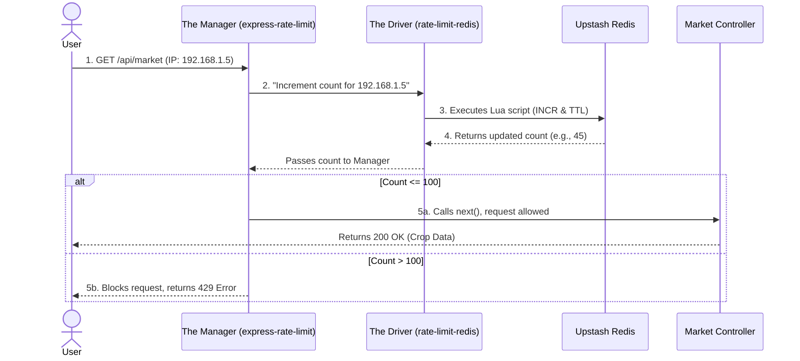

# 🚦 Rate Limiting: The Complete Engineering Guide (Interview Ready)

Rate limiting is a critical defensive engineering concept. It controls the amount of incoming traffic to your server, ensuring stability, security, and fair usage. This document serves as a master reference and interview-prep guide, structured as a logical journey from the core problems to the final implementation.

---

## 1. The Problem: Why Do We Need Rate Limiting?

Before writing code, we must understand the threats facing modern servers. Without rate limiting, an API is completely defenseless against four major issues:

1.  **DDoS Mitigation:** If a botnet sends 50,000 requests per second to your server, your CPU will hit 100% and your database will crash. A rate limiter intercepts these requests at the network edge and drops them instantly, keeping the server alive for real users.
2.  **Security (Stopping Brute Force):** By applying a strict limit of 5 requests per 15 minutes to `/api/auth/login`, you make it mathematically impossible for a hacker to guess a password.
3.  **Preventing Resource Starvation:** A poorly written `useEffect` hook on the frontend might accidentally trigger an infinite loop, spamming the backend API. Rate limiting protects the backend from your own frontend bugs.
4.  **API Monetization & Quotas:** SaaS companies (like Stripe, OpenAI) use rate limits to enforce billing tiers (e.g., "Free tier: 100 API calls/day", "Pro tier: 10,000 API calls/day").

---

## 2. The Core Concepts: Defining the Threats

To communicate these problems professionally in an interview, use these precise definitions:

*   **Rate Limiting:** A technique used to control the rate of traffic sent or received by a network interface.
*   **DDoS (Distributed Denial of Service):** A malicious attempt to disrupt the normal traffic of a targeted server by overwhelming it with a flood of fake internet traffic. It is "Distributed" because the attack originates from thousands of compromised computers (a botnet) simultaneously, making it impossible to block a single IP address.
*   **Brute Force / Credential Stuffing:** An attack where a script rapidly submits thousands of password combinations to a `/login` endpoint in seconds, hoping to guess the correct credentials.

---

## 3. The Logic: How Do We Stop Them? (The 5 Algorithms)

Now that we know the threats, how do we mathematically decide who gets blocked and who gets passed? Engineers use one of five core algorithms to calculate the limits.

### 1. Fixed Window Counter (The Default)
*   **How it works:** Time is divided into strict blocks (e.g., `12:00` to `12:01`). The server counts requests. At exactly `12:01`, the counter instantly resets to 0.
*   **RAM Signature:** Two small integers (Current Count & Reset Timestamp).
    ```json
    { "192.168.1.10": { "count": 45, "resetTime": 1729837000 } }
    ```
*   **Pros:** Very cheap on memory.
*   **The Fatal Flaw (Burst Edge):** A hacker can send 100 requests at `12:00:59` and 100 requests at `12:01:01`, successfully hitting your server 200 times in exactly 2 seconds.
*   **Node.js Implementation Example:**
    ```javascript
    const requests = new Map();
    const WINDOW_MS = 60 * 1000;
    const MAX_REQUESTS = 100;

    function fixedWindow(req, res, next) {
      const ip = req.ip;
      const now = Date.now();
      
      let entry = requests.get(ip);
      if (!entry || now - entry.start > WINDOW_MS) {
        entry = { count: 1, start: now };
        requests.set(ip, entry);
      } else {
        entry.count++;
      }

      if (entry.count > MAX_REQUESTS) {
        res.status(429).send('Rate limit exceeded - Fixed Window');
      } else {
        next();
      }
    }
    ```

### 2. Sliding Window Log (The RAM Killer)
*   **How it works:** Throws away the clock and saves the exact millisecond timestamp of every single request in a log. When a new request arrives, it looks back exactly 60 seconds from *right now*, deletes older logs, and counts the remainder.
*   **RAM Signature:** A massive array of exact timestamps.
    ```json
    { "192.168.1.10": [ 1729837001, 1729837002, 1729837005 /* ... 50,000 more */ ] }
    ```
*   **Pros:** 100% mathematically accurate. Perfectly solves the Burst Edge flaw.
*   **The Fatal Flaw:** Destroys RAM. Saving 50,000 exact timestamps for millions of IPs uses so much memory it can accidentally crash the server.
*   **Node.js Implementation Example:**
    ```javascript
    const logs = new Map();
    const WINDOW_SIZE = 60 * 1000;
    const MAX_REQUESTS = 10;

    function slidingWindowLog(req, res, next) {
      const ip = req.ip;
      const now = Date.now();
     
      let timestamps = logs.get(ip) || [];
      timestamps = timestamps.filter(ts => now - ts < WINDOW_SIZE);
      timestamps.push(now);

      logs.set(ip, timestamps);
     
      if (timestamps.length > MAX_REQUESTS) {
        res.status(429).send('Too Many Requests - Sliding Window');
      } else {
        next();
      }
    }
    ```

### 3. Sliding Window Counter (The Gold Standard)
*   **How it works:** A mathematical hybrid used by **Cloudflare**. It uses fixed windows but calculates a rolling weighted average. Formula: `(Prev Window Count × % of overlapping time) + Current Window Count`.
*   **RAM Signature:** Two tiny integers (Previous Window Count & Current Window Count).
    ```json
    { "192.168.1.10": { "prevWindowCount": 80, "currWindowCount": 30 } }
    ```
*   **Pros:** Perfectly solves the Burst Edge flaw while using almost zero RAM.

### 4. Token Bucket (The Amazon/Stripe Standard)
*   **How it works:** Imagine a literal bucket holding exactly 10 tokens. The server mathematically calculates downtime to "refill" the bucket (e.g., exactly 1 token per second). If you have tokens, your request passes. If the bucket is empty, you are blocked.
*   **RAM Signature:** The current number of tokens, and the last time it refilled.
    ```json
    { "192.168.1.10": { "tokens": 4, "lastRefill": 1729837000 } }
    ```
*   **Pros (Burst Friendly):** Allows users to "burst" traffic. If your bucket is full, you can instantly fire 10 requests at the same millisecond. But once empty, you are strictly throttled to the slow refill speed.
*   **Node.js Implementation Example:**
    ```javascript
    const buckets = new Map();
    const MAX_TOKENS = 10;
    const REFILL_RATE = 1; // tokens per second

    function tokenBucket(req, res, next) {
      const ip = req.ip;
      const now = Date.now() / 1000;

      let bucket = buckets.get(ip) || { tokens: MAX_TOKENS, lastRefill: now };
      const elapsed = now - bucket.lastRefill;
      bucket.tokens = Math.min(MAX_TOKENS, bucket.tokens + elapsed * REFILL_RATE);
      bucket.lastRefill = now;
      
      if (bucket.tokens >= 1) {
        bucket.tokens -= 1;
        buckets.set(ip, bucket);
        next();
      } else {
        res.status(429).send('Too Many Requests - Token Bucket');
      }
    }
    ```

### 5. Leaky Bucket (The Traffic Smoother)
*   **How it works:** Think of a bucket with a hole in the bottom. Requests pour into the top, but the hole at the bottom leaks them out to the server at a perfectly steady, unchangeable rate (e.g., 1 request per second). If it fills up, new requests spill over and are blocked.
*   **RAM Signature:** An array acting as a FIFO Queue (First In, First Out), and a timestamp for the last drip.
    ```json
    { "192.168.1.10": { "queue": ["req_1", "req_2"], "lastLeak": 1729837000 } }
    ```
*   **Pros (No Bursts Allowed):** Forces traffic to be completely smoothed out. Perfect for protecting ancient, fragile legacy databases that crash if they get 5 concurrent connections.
*   **Node.js Implementation Example:**
    ```javascript
    const buckets = new Map();
    const CAPACITY = 10;
    const LEAK_RATE = 1; // requests per second

    function leakyBucket(req, res, next) {
      const ip = req.ip;
      const now = Date.now() / 1000;
      
      let bucket = buckets.get(ip) || { volume: 0, lastCheck: now };
      const elapsed = now - bucket.lastCheck;
      bucket.volume = Math.max(0, bucket.volume - elapsed * LEAK_RATE);
      bucket.lastCheck = now;
      
      if (bucket.volume < CAPACITY) {
        bucket.volume += 1;
        buckets.set(ip, bucket);
        next();
      } else {
        res.status(429).send('Too Many Requests - Leaky Bucket');
      }
    }
    ```

---

## 4. The Storage: Where Do We Keep The Tally?

Regardless of which algorithm you choose, the server needs physical memory to store the counts. 

### Development Standard: The `MemoryStore`
*   **What it is:** An ephemeral (temporary) storage mechanism that keeps data directly in the active RAM of the application process (like Node.js). 
*   **How it works:** By default, libraries like `express-rate-limit` create an invisible JavaScript `Map` object in the server's RAM. 
    ```json
    {
      "192.168.1.10": { "count": 45, "resetTime": 1729837000 }
    }
    ```
*   **The Problem:** If you restart your Node server, the RAM is wiped, and all limits reset to zero. More importantly, if you deploy 3 backend servers behind a Load Balancer, each server has its own isolated RAM. A hacker could hit Server A 100 times, Server B 100 times, and Server C 100 times, getting 3x the allowed limit.

### Industry Standard: Centralized `Redis`
*   **What it is:** In production, enterprise applications attach their rate limiters to **Redis** (An incredibly fast In-Memory Database).
*   **How it works:** All 3 backend servers ask the central Redis database: *"How many requests has this IP made?"* 
*   **The Benefit:** The count is perfectly synchronized across the entire globe, and it survives if the Node.js server crashes.

---

## 5. The Application: How is it used in AgriSense?

Finally, how do we take all these theories and apply them to our actual codebase? AgriSense implements rate limiting to protect the backend from abuse using a **Global Shield** approach.

*   **The Packages (Modular Architecture):** We use a dual-package setup to enforce a strict separation of concerns:
    *   `express-rate-limit` **(The Manager):** This is the HTTP middleware. It intercepts requests, extracts IPs, holds the rules (`max: 100`), and sends the `429 Too Many Requests` error to the frontend. It is completely database-agnostic.
    *   `rate-limit-redis` **(The Storage Driver):** This is the bridge. It listens to the Manager and translates its increment requests into raw, highly-optimized Lua scripts (using commands like `INCR` and `PEXPIRE`) executed directly on the Upstash Redis server.
*   **The Algorithm:** It runs the **Fixed Window Counter** algorithm under the hood.
*   **The Storage:** It uses a centralized **RedisStore** connected to Upstash, meaning our limits are perfectly synced even if we spin up multiple backend servers.
*   **The Code Implementation:**
    In `backend/server.js`, we enforce a global limit across the entire application:
    ```javascript
    const limiter = rateLimit({
      windowMs: 15 * 60 * 1000, // The fixed window (15 minutes)
      max: 100,                 // The max counter (100 requests)
      message: { message: 'Too many requests, please try again after 15 minutes' },
      store: new RedisStore({
        sendCommand: (...args) => redisClientWrapper.rawClient.sendCommand(args),
      }),
    });
    
    // The Global Shield: Applies to EVERY route starting with /api/
    app.use('/api/', limiter); 
    ```
    This means if a user hits 100 requests on `/api/market`, they are also blocked from `/api/auth/login`, because they all share one single global counter stored securely in our centralized Redis database.

### The Request Lifecycle (Step-by-Step Flow)

To understand exactly what happens in milliseconds when a user hits the AgriSense API:



1. **The Request Arrives:** A user calls `GET /api/market`.
2. **The Manager Intercepts:** `express-rate-limit` steps in front of the route and extracts the IP address.
3. **The Delegation:** The Manager asks the Storage Driver (`rate-limit-redis`) to increment the tally.
4. **The Database Ping:** The Translator sends a highly-optimized `INCR` command across the internet to the Upstash Redis database. Redis instantly returns the updated integer count.
5. **The Final Decision:** The Manager compares the returned count against the rule (`max: 100`):
   *   ✅ **Under Limit:** The Manager calls `next()`. The request enters the business logic (Market Controller).
   *   ❌ **Over Limit:** The Manager instantly blocks the request, returning a `429 Too Many Requests` error to the frontend.

---

## 6. Conclusion: Which Strategy to Choose?

Rate limiting is more than just protection — it’s **resource governance**. Choosing the right strategy comes down to your application’s tolerance for burst traffic, precision needs, and memory tradeoffs.

*   **Choose Token Bucket:** If burst control is essential (e.g., modern APIs like Stripe).
*   **Choose Leaky Bucket:** For uniform output pacing (e.g., protecting fragile legacy databases).
*   **Use Fixed Window:** For simplicity, general-purpose throttling, and low memory footprints.
*   **Use Sliding Log:** For high precision and ultra-security-critical routes (assuming you have the RAM to support it).

*Note: For distributed environments or clustered Node.js apps, always consider storing rate data in **Redis** for centralized throttling.*


## 7. Route-Specific Architecture & Reasoning

AgriSense utilizes a hybrid approach, combining a global fallback limit with highly specialized, route-specific Token Buckets to balance user experience (allowing bursts) with strict security (slow refills).

| Route | Algorithm | Configuration | Why? |
| :--- | :--- | :--- | :--- |
| **Global (all routes)** | Fixed Window | 100 requests / 15 min | Baseline protection against excessive traffic and simple DoS attempts. Acts as a safety net even if route-specific limits are bypassed. |
| **POST /api/auth/login** | Token Bucket | Burst: 5, Refill: 1 token/min | Users may mistype passwords a few times. Allows immediate retries while mathematically killing brute-force and credential-stuffing attacks. |
| **POST /api/auth/register** | Token Bucket | Burst: 3, Refill: 1 token/15 min | Registration is infrequent. Prevents mass account creation with different email addresses and reduces unnecessary database load. |
| **POST /api/auth/send-otp** | Token Bucket | Burst: 3, Refill: 1 token/10 min | OTP emails consume provider resources and may incur cost. Allows a few resend attempts while preventing spam and quota exhaustion. |
| **POST /api/auth/verify-otp** | Token Bucket | Burst: 5, Refill: 1 token/10 min | Users may mistype OTPs a few times. Limits OTP guessing without frustrating legitimate users. |
| **POST /api/ml/predict/*** | Token Bucket | Burst: 10, Refill: 1 token/min | ML inference is computationally expensive. Allows users to try a few images quickly but prevents continuous requests from exhausting compute resources. |
| **GET /market, /expenses** | Global limiter only | No separate limiter | These are normal read endpoints. The global limit is sufficient. Add route-specific limits only if monitoring shows abuse or database quotas become an issue. |
