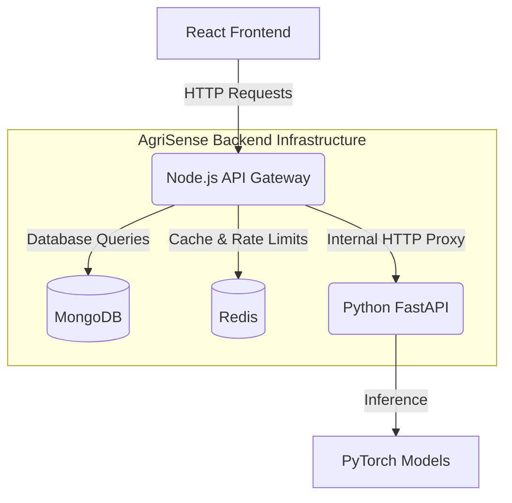
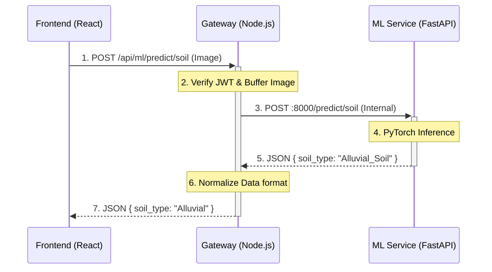

# System Architecture & API Gateway Integration

This document outlines the high-level system design, service boundaries, and internal network proxying mechanisms utilized within the AgriSense platform. 

## 1. Microservice Ecosystem Overview

AgriSense is designed using a dual-backend microservice architecture to isolate computational boundaries and optimize resource allocation.

*   **Primary Gateway (Node.js / Express):** Operating on port `5000`, this service acts as the central ingress point for all client traffic. It handles I/O bound tasks, authentication, database operations (MongoDB), caching (Redis), and rate limiting.
*   **Machine Learning Engine (Python / FastAPI):** Operating on port `8000`, this isolated microservice is strictly responsible for CPU-bound tasks, specifically executing PyTorch and scikit-learn model inferences for soil classification, crop recommendation, and price forecasting.

Client applications (React Frontend) **never** interact directly with the Machine Learning Engine. The Node.js service abstracts this complexity.

> [!NOTE]
> **Note:** If someone asks *why* you separated Node and Python, tell them it's about playing to their strengths. Node.js is incredibly fast at handling thousands of small, simultaneous network requests (I/O bound). Python is the undisputed king of heavy, mathematical Machine Learning (CPU bound). If you put them both in one server, Python's heavy math would freeze the Node.js server!

---

## 2. The API Gateway Pattern

To enforce strict security and simplify client-side network management, the Node.js Express server implements the **API Gateway Pattern**. 

### Core Responsibilities of the Gateway:
1.  **Centralized Authentication:** Instead of requiring both Node.js and Python to validate JWT tokens, the Express Gateway intercepts all incoming traffic, validates the session, and rejects unauthorized requests before they ever reach internal services.
2.  **Request Sanitization & Validation:** The Gateway ensures that payloads conform to expected schemas and file size limits (via `multer`) before forwarding.
3.  **Reverse Proxying:** The Gateway acts as a transparent proxy. It takes validated requests, constructs internal network calls to the Python service, awaits the computation, and returns the serialized JSON to the client.

> [!TIP]
> **Analogy:** Imagine a massive corporate office building. An API Gateway is the **front desk receptionist**. The React frontend doesn't need to memorize where the ML department is. It just hands the request to the Node.js receptionist, and Node.js routes it to the correct hidden department.

---

## 3. Inter-Service Communication Trace: Soil Classification

To illustrate the data flow across service boundaries, consider the end-to-end execution of a Soil Classification request.

1.  **Client Ingress:** The React client dispatches a `multipart/form-data` payload containing an image to `POST https://api.agrisense.com/api/ml/predict/soil`.
2.  **Gateway Security & Parsing (Node.js):**
    *   The `protect` middleware verifies the HTTP-Only JWT.
    *   The `multer` middleware buffers the incoming image stream into RAM, enforcing a 10MB limit.
3.  **Proxy Invocation:** The Express controller repackages the image buffer into an internal `FormData` payload. Using Axios, it makes a synchronous HTTP POST request over the internal network to the FastAPI service (`http://localhost:8000/predict/soil`).
4.  **AI Inference (Python):**
    *   FastAPI routes the payload to the PyTorch inference engine.
    *   The model evaluates the image tensor and generates class probabilities.
    *   FastAPI responds to the Gateway with a JSON object containing the classification and confidence scores.
5.  **Data Normalization & Egress (Node.js):** 
    *   The Gateway receives the internal response.
    *   It normalizes the data structure (e.g., stripping internal suffix naming conventions).
    *   Finally, the Gateway serializes the payload and transmits the HTTP 200 OK response back to the original React client.

---

## 🎯 Architecture & Data Flow Q&A

**How do the frontend and backend connect?** or **Walk me through your system architecture.** Here is the explanation:

> "My application uses a dual-backend **Microservice Architecture** over the **HTTP protocol**. 
> 
> It starts on the frontend. When a user interacts with the React app, it uses Axios to send an HTTP Request to a specific URL endpoint on our primary backend.
> 
> Our primary backend is a Node.js server running Express. It acts as our **API Gateway**. Before the request hits the main logic, it flows through our middleware pipeline—where it handles CORS, rate limiting via Redis, and centralized JWT authentication. 
> 
> Because we have heavy machine learning tasks, I separated our AI logic into an isolated **Python FastAPI Microservice**. Node.js doesn't do the heavy math; instead, the Express controller safely proxies the validated request to Python over the internal network. Python runs the PyTorch inference and sends the result back to Node. 
> 
> Finally, because the frontend and backend are separate environments, Node uses the `res.json()` method to serialize the final data into a **JSON string** and fires it back inside an **HTTP Response**. The React frontend parses that JSON, updates its State, and immediately re-renders the UI."
